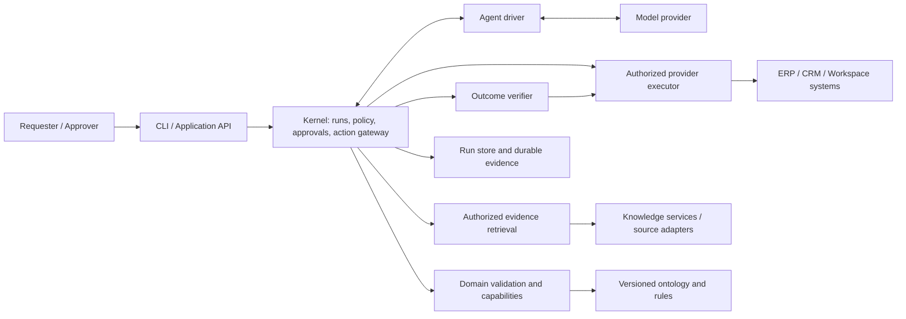
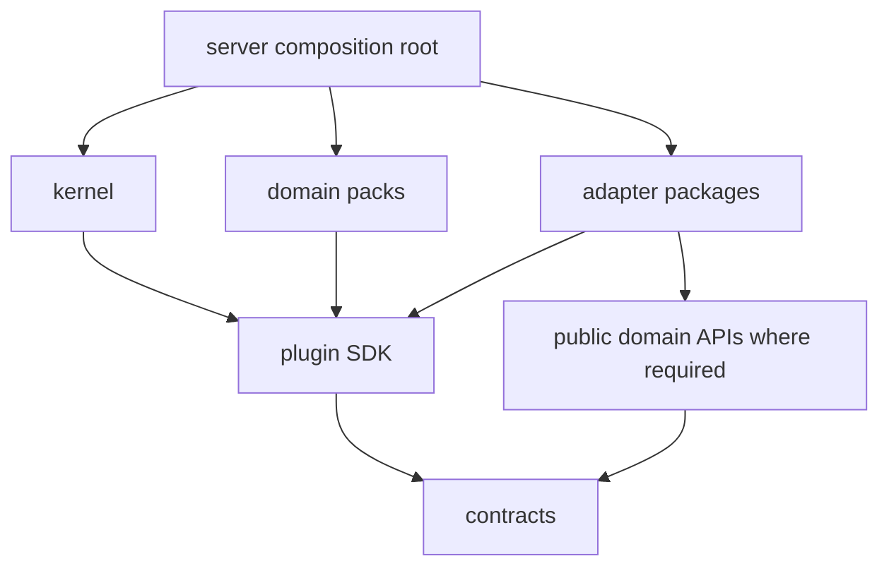
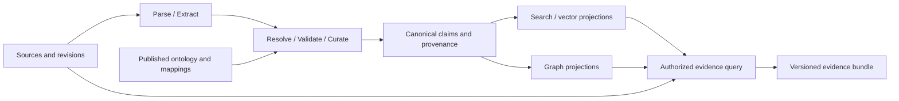

# e-agent: high-level design

**Status:** proposed implementation baseline. **Date:** 2026-10-06. **Implementation status:** research/design only.

> **Scope update.** [ADR 0001](adr/0001-local-mvp-scope.md) (accepted) expands the MVP to a local Pydantic AI + Ollama driver, the `odoo19-learning` Odoo 19 sandbox with an `e_agent_bridge` addon, 5–10 Odoo tasks, a streaming overlay UI and a read-only BigQuery integration. Where this document says "MVP", read it together with that ADR and the [implementation plan](implementation-plan.md). Proposed refinements are recorded as ADRs 0002–0013 ([index](adr/README.md)) and take effect only when accepted.

This design consolidates [research 02](../research/02-plugin-driven-architecture.md), [03](../research/03-knowledge-and-cognitive-ontology.md), [07](../research/07-package-and-plugin-organization.md), [08](../research/08-architecture-decisions-and-fitness.md) and the latest [extensibility review](../research/10-extensibility-architecture-review.md). The [MVP detailed design](mvp-detailed-design.md) defines the first implementation slice. Technology candidates remain subject to the bounded compatibility spikes described there.

## 1. Purpose and scope

Build an enterprise agent application that performs bounded business tasks with explicit authority, domain semantics, traceable evidence and independently verified outcomes. The platform must support new domains and providers without making the kernel depend on them, and allow knowledge organization and agent technology to evolve with measurable migration costs.

The first product demonstrates procurement in an isolated Odoo sandbox. The experimental agent at `/Users/thanhnguyen/dev/lab/enterprise-agent/experiment` remains a research/evaluation reference. The product must not import it, depend on its filesystem layout or reuse protected evaluation outputs as demo evidence.

### Goals

- Extend business capabilities through versioned domain packs and provider plugins.
- Keep authorization, approvals, action state and outcome records under application control.
- Replace agent drivers, model providers and knowledge implementations through explicit contracts and tests.
- Preserve provenance, tenant scope and semantic versions across knowledge and action flows.
- Make packages independently buildable, testable and releasable while keeping initial deployment simple.
- Prepare structured explanation data for a later UI without persisting hidden model reasoning.

### Initial exclusions

The MVP does not include a plugin marketplace, arbitrary untrusted code execution, a generic workflow language, unrestricted autonomous ERP writes, external CRM providers or Google integrations, production multitenant hosting, a full knowledge ingestion platform or a graph-governance authoring UI. Per ADR 0001 it does include a streaming overlay UI for task interaction and approval, Odoo CRM lead creation as an Odoo binding, and parameterized read-only BigQuery analytics. Enterprise certifications and production readiness are not implied by this design.

## 2. Architectural drivers

| Driver | Design response | Evidence required |
|---|---|---|
| Rapid model/framework changes | Thin AgentDriver adapter; framework continuation separate from business history | Driver conformance and explicit continuation upgrade handling |
| Multiple domains | Kernel operates on capability contracts, not ERP types | Run a non-ERP fixture without installing ERP packages |
| Multiple providers/accounts | Separate capability definition, implementation binding and connection | Correct binding selection, authorization and ambiguity rejection |
| Knowledge evolution | Separate sources, curated claims, ontology and derived projections | Competency questions, migration, deletion and ACL regression |
| Independent extensions | Public SDK, separate distributions, scoped injected services | Clean wheel installation and compatibility matrix |
| External side effects | Durable reservation, approval, dispatch evidence and reconciliation | Fault injection around the external commit boundary |
| Explainability | Versioned evidence, validation findings, receipts and outcome reports | Inspectable run export without secrets or hidden chain-of-thought |

Flexibility means a bounded, testable change surface. It does not mean every provider has identical semantics or every migration is configuration-only.

## 3. System context

Actors are a task requester, an authorized approver, an operator investigating failures and, later, a domain/ontology steward. Requester and approver permissions are explicit even if one local demo operator holds both roles.

The diagram shows runtime interactions. Concrete implementations are wired by the application composition root. The model and driver never receive an unrestricted provider client or database session. Verifier reads also pass through authorized provider access.

## 4. Deployment and package architecture

Use a Python monorepo and a modular monolith. Initially one server process coordinates runs; PostgreSQL persists state; Odoo is external. A separate worker process may use the same application distribution when needed. Packages are release boundaries, not automatically services.

Python 3.12+ and uv are proposed development baselines. Exact runtime and dependency versions must be pinned and tested during bootstrap. The root is workspace/tooling configuration, not another business distribution.

| Distribution | Responsibility | Allowed first-party dependencies |
|---|---|---|
| `e-agent-contracts` | Generic wire DTOs, identity context, action/evidence/event records | None |
| `e-agent-plugin-sdk` | Public ports, manifests, registration, lifecycle | Contracts |
| `e-agent-kernel` | Run coordination, action gate, approval, policy application, budgets | Contracts, SDK |
| `e-agent-domain-erp` | Bounded-context modules (procurement, inventory, sales, crm, receivables): contracts, capability semantics, rules, ontology assets, verifier specifications | Contracts, SDK |
| `e-agent-domain-analytics` | Metric definitions and query specs (ADR 0001, I12) | Contracts, SDK |
| `e-agent-adapter-agent-pydantic` | Pydantic AI 2.x driver selected by ADR 0001; configuration qualified in I04 ([ADR 0004](adr/0004-agent-driver-integration.md)) | Contracts, SDK |
| `e-agent-adapter-odoo` | ERP transport, connection-specific mapping, reconciliation reads | Contracts, SDK, public ERP API |
| `e-agent-adapter-postgres` | RunStore/UnitOfWork implementation and database migrations | Contracts, SDK |
| `e-agent-adapter-shacl` | Validation engine implementation | Contracts, SDK |
| `e-agent-adapter-bigquery` | Allowlisted, parameterized read-only query execution | Contracts, SDK, public analytics API |
| `e-agent-adapter-secretstore-local` | Local envelope-encrypted `SecretStore` (MVP); vault/cloud adapters later | Contracts, SDK |
| `e-agent-server` | API/CLI, bootstrap, authentication context, application workflows, SSE stream | Required distributions above |

Non-wheel artifacts: `addons/e_agent_bridge` (Odoo 19 addon, versioned and released separately; [ADR 0005](adr/0005-odoo-integration-transport.md)) and the TypeScript UI workspace. The UI workspace contains `@e-agent/client`, `ui-core`, `tokens`, `ui-react`, `components`, layouts, `apps/web`, the `<e-agent-overlay>` element and the UI conformance suite. These layers let a deployer re-theme, re-layout or replace the default UI while reusing the lower layers ([UI architecture](ui-architecture.md), ADR 0011, proposed). The UI depends only on the server API and is system-neutral: it runs standalone or embedded in any web page, and no UI layer depends on Odoo or another provider. Approval stays a kernel concept.

Each adapter is a separate artifact rather than a module in a shared `integrations` distribution. This supersedes the earlier six-package proposal. Third-party dependencies belong in the distribution that uses them; core contracts may use Pydantic, but must not contain framework message classes, ORM objects or vendor responses.

This is the dependency direction. Kernel must not import domains, adapters or server. Domain packs must not import concrete adapters. Adapter implementations must not import each other. Only bootstrap chooses concrete implementations. Cross-domain workflows belong to application modules and use public capabilities; domain packs do not acquire mutual implementation dependencies.

Independent release means each distribution declares dependencies, has a version, builds a wheel and passes clean-install/conformance tests. It does not mean zero dependencies or that every library launches its own service. A conflicting or untrusted plugin requires a separate environment/process and, where appropriate, OS/network isolation; a subprocess alone is not a security sandbox.

## 5. Domains, providers and connections

| Concept | Example | Ownership |
|---|---|---|
| Domain | Procurement, CRM, document collaboration | Business vocabulary, constraints, use cases and acceptance criteria |
| Capability contract | `procurement.purchase-order.create-draft.v1` (named by business context, not provider category; [ADR 0002](adr/0002-capability-naming-and-domain-packs.md)) | Typed input/output and effect semantics |
| Implementation binding | An Odoo implementation of that contract | Adapter identity and supported features |
| Connection | One tenant's Odoo database or Google account | Resource scope, credentials reference, grants and health |

Google Workspace is a provider family, not one business domain. A future CRM workflow can use Drive documents and ERP records without importing Google or Odoo internals into CRM logic.

Multiple bindings may implement the same capability contract. Host resolution combines tenant, authorized connection, resource scope, compatibility and feature requirements. Conflicting definitions for the same contract ID, duplicate binding IDs and unresolved ambiguity are errors. The agent may propose a target; it cannot select credentials or grant access.

Shared business identity uses reviewed mappings with provenance and scope. Matching names is not sufficient to merge a CRM account with an ERP supplier. Extract shared ontology modules only when there is demonstrated reuse; avoid a universal business-object model that erases domain meaning.

## 6. Plugin and execution boundaries

The SDK exposes narrow ports: AgentDriver, CapabilityProvider, PlanValidator, ActionExecutor, EvidenceRetriever, OutcomeVerifier, RunStore/UnitOfWork, PolicyEvaluator and EventObserver. The MVP design assigns exact initial responsibilities.

Plugins follow metadata discovery → admission → initialization → activation → draining/stopping. Discovery must not execute plugin code. Admission checks an explicitly enabled artifact, manifest, compatibility and required grants before loading its factory. Artifacts are installed by deployment tooling, never by model-generated instructions during a run.

Platform policy and mandatory audit are trusted bindings, not replaceable by tenant-installed extensions. Observer failure may be nonfatal; inability to persist required pre-dispatch evidence blocks writes. Constructors have no network/business side effects. Lifecycle operations have deadlines and explicit cleanup.

The framework owns model interaction and tool-request continuation. The kernel owns permission checks, approval, business state, execution admission and outcome coordination. External actions are deferred to the gateway. A framework upgrade must drain or explicitly migrate active continuations; serialized framework memory is not the canonical action record.

## 7. Knowledge and ontology architecture

Source systems retain authority over their transactions. The claim registry records accepted observations and derivations; indexes are rebuildable views. Direct authorized source reads remain available for current transactional state.

Knowledge responsibilities are separate from kernel state: ingestion/checkpoints, parsing/extraction, identity resolution, curation, ontology publication, claim storage, projection building and evidence queries. Introduce `e-agent-knowledge` when ingestion/curation is implemented, exposing a narrow public API. Domain schemas are registered rather than imported from concrete domain implementations.

Stable contracts preserve source revision, locator, entity/claim identity where applicable, tenant scope, provenance, ontology/mapping versions, valid/recorded time where used, freshness and completeness. Backend support for traversal, temporal queries or inference is explicit. Unsupported semantics cannot be silently replaced with an approximate answer.

Rechunking or changing embeddings requires reindexing and retrieval evaluation. Changing claim semantics or authoritative storage requires versioned migration and consumer review. Shadow projection cutover must preserve revocations/deletions, including during rollback. Current authorization still applies to historical queries.

Domain ontology and shapes are versioned assets owned by domain stewards. SHACL validates declared constraints; policy establishes permission; ERP read-back establishes task outcome. These are different responsibilities. Cognitive records represent goals, evidence, proposals, observations and outcomes, not privileged access to model reasoning. Working/episodic memory cannot publish directly into curated knowledge.

The MVP packages a small procurement ontology and reads typed ERP facts. Full ingestion, graph storage, ontology authoring UI and knowledge governance workflows are Phase 2.

## 8. Data ownership and consistency

| Data | Logical owner | Initial persistence |
|---|---|---|
| Runs, proposals, approval, action ledger, receipts, outcome reports | Kernel services | PostgreSQL through RunStore |
| ERP purchase orders and master data | ERP | Odoo; local records retain references and evidence |
| Capabilities, ontology, shapes and rule inventory | Domain pack | Immutable packaged resources |
| Connections and secret references | Integration admin (generic, schema-driven; [ADR 0012](adr/0012-schema-driven-integration-management.md), proposed) | Versioned connection records; secrets only in a `SecretStore` adapter (local-encrypted in MVP), never in profiles, UI or model context |
| Source revisions, curated claims | Knowledge services, when implemented | Versioned registry/store |
| UI/search/graph views | Projection owners | Derived indexes |

A module owns its write path and migrations. Local reservation/state/event updates use one transaction where required. No transaction spans PostgreSQL and Odoo. Uncertain external results remain unresolved until reconciliation; retries must not assume an external write failed merely because its response was lost.

Use explicit versions for distribution, plugin API, capability contract, wire schema, ontology/rules, persistence and framework continuation. Version pinning preserves provenance but never overrides a current revocation. Database changes with overlapping deployments use expand/migrate/contract. Compatibility is supported by fixtures and tested ranges, not version labels alone.

## 9. Security, operations and explanation

Every request receives a trusted identity/tenant context. Every provider action receives a scoped connection. The agent sees only authorized capability schemas and redacted results. No secrets, raw administrative clients, unrestricted SQL or filesystem installation tools enter model context.

Knowledge content is untrusted data. Content cannot change policy or become approved executable instructions. Access checks apply before content reaches the model and again before actions are dispatched. Resource changes after approval can invalidate the proposal.

The scoped [MVP threat model](threat-model.md) maps these controls to the OWASP Agentic Top 10. Telemetry follows [ADR 0008](adr/0008-observability.md): OpenTelemetry with content capture off by default.

Persist enough structured evidence to show goal → source facts → validation → proposal → approval → receipt → verified outcome. Export authorization and redaction apply to evidence as well as operational APIs. Optional telemetry is separate from required durable action records. Track task outcomes, failures, unknown actions, latency, retries, token usage and rule violations without using high-cardinality sensitive payloads as metric labels.

Local demo identity mapping is an explicitly bounded development mode. Production requires real identity integration, tested tenant isolation, secrets management, operational recovery, retention policy and security review. This design does not assert those controls already exist.

## 10. Evolution and decision baseline

| Decision | Baseline | Revisit trigger |
|---|---|---|
| Deployment | Modular monolith, separate package artifacts | Trust, load, residency or operational ownership requires a service boundary |
| Agent runtime | One framework driver; platform-controlled actions | Failed spike/conformance, material cost or capability gap |
| Integrations | Separate adapter distributions from the start | Shared lower-level library only when duplication warrants it |
| Knowledge | Canonical evidence/semantics before graph infrastructure | Real competency queries require graph/inference services |
| Plugins | Reviewed first-party implementations in-process | Third-party trust/dependency isolation requires remote protocol and sandbox |
| Durability | Explicit state machine and DB transactions | Long-running orchestration needs justify a durable workflow engine |

MVP delivers a verified procurement slice first, then the ADR 0001 task catalog, overlay UI and BigQuery gates, plus architecture gates. Phase 2 adds evidence-explanation and governance UI, governed KB/KG, CRM/Google connectors driven by real workflows, and broader operational controls. Later production rollout depends on target enterprise requirements and evidence, not simply completing the feature list.

ADR 0001 selected Odoo 19 (`odoo19-learning`), Pydantic AI and Ollama. Outstanding selections are the exact Pydantic AI 2.x and model versions, the Odoo transport details (proposed: JSON-2 plus bridge, ADR 0005), BigQuery scope and the artifact distribution method. Resolve and record them during bootstrap. Do not invent production SLAs before workload and deployment constraints are known.

## 11. References

- [MVP scope and evidence](../research/06-erp-mvp-delivery-plan.md)
- [Latest extensibility review](../research/10-extensibility-architecture-review.md)
- [Knowledge semantics and governance](../research/03-knowledge-and-cognitive-ontology.md)
- [Enterprise controls](../research/04-enterprise-controls-and-roadmap.md)
- [Architecture sources](../research/09-architecture-source-register.md) and [broader source register](../research/05-source-register.md)
