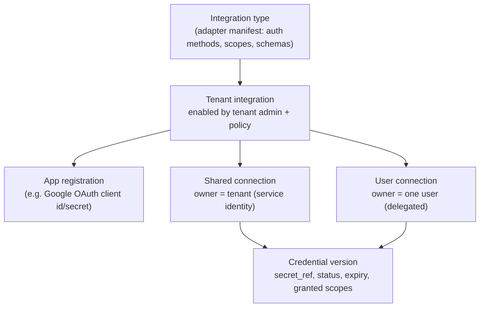

# Integration auth SDK: credentials and authentication for every integration

**Date:** 2026-10-06. **Status:** accepted design ([ADR 0013](adr/0013-integration-auth-sdk-and-delegated-connections.md)); nothing is implemented. It refines [integration management](integration-management.md) (ADR 0012). Admin and user pages are **Phase 2**; the MVP implements only the subset in §11.

## 1. Goal

One SDK that every provider adapter (Odoo, Google Workspace, CRMs, BigQuery, MCP servers, future systems) uses for authentication, so that:

- adapters declare *which* auth methods they support and never implement storage, OAuth flows, refresh, encryption or audit themselves;
- **tenant admins** enable an integration and supply tenant-level configuration, such as a Google OAuth client ID and secret;
- **users** connect their *own* accounts (an Odoo API key, Google OAuth consent), and the agent then acts with exactly that user's provider permissions;
- the kernel, UI and model never see secret material, and no UI code knows any provider (ADR 0011/0012).

### Worked examples (target behaviour)

| Integration | Tenant admin does | User does | Agent executes as |
|---|---|---|---|
| Odoo 19 | Enables Odoo; sets base URL, database, allowed companies; allows user connections (method `api_key`) | Opens *My integrations → Odoo*, pastes a **personal Odoo API key** generated in Odoo (Preferences → Account Security) | That Odoo user; Odoo's access rights and record rules still apply |
| Google Workspace | Enables Google; registers an OAuth client in their Google Cloud project, enters **client ID + client secret**, chooses allowed scopes, optionally restricts to the company domain | Clicks *Connect Google*, signs in and consents (OAuth authorization code + PKCE) | That Google user, limited to the scopes actually granted |

> **Odoo note.** The user's example used Basic auth (username/password). Odoo 19's JSON-2 API accepts only **API keys** as bearer tokens; login and 2FA belong to the web client. The Odoo adapter therefore declares `api_key`. The SDK still provides `basic` for providers that need it. An API key carries the user's own Odoo groups and record rules.

## 2. Research basis (2026-10)

| Source | Adopted idea |
|---|---|
| Auth0 Token Vault (federated connections for AI agents): the agent never holds provider refresh tokens; it exchanges for a fresh scoped access token at call time | Refresh tokens stay in the host vault; adapters receive only short-lived access material |
| Arcade.dev just-in-time authorization: when a tool needs an unconnected service, the user gets an auth URL (MCP URL-mode elicitation), connects once, and tokens are vaulted and refreshed | The run pauses with a `connect_required` request, and the user connects in the UI. Scopes are requested per capability (least privilege) |
| Nango: managed OAuth, API keys and refresh across many APIs, multi-tenant connections, self-hostable | Same separation of integration (type), connection (per tenant or user) and credential. Nango remains a possible backend behind our port |
| Airbyte declarative OAuth, n8n credential types | Auth flows declared in the manifest; credential types reusable across adapters |
| RFC 9700 OAuth 2.0 Security BCP | Authorization code + PKCE, `state`, exact redirect URIs, refresh rotation and reuse detection, no implicit or password grants |
| Google OAuth: granular consent (users may deselect scopes, so partial grants arrive without an error); refresh tokens of "Testing" external apps expire after 7 days | Always store and check the **granted** scope list; handle `invalid_grant` as "re-auth required"; production publishing status is required for durable connections |
| MCP authorization (OAuth 2.1, RFC 9728, RFC 8707) | Same engine supports MCP servers later |

## 3. Concepts and ownership



| Object | Created by | Contains (no secret values outside SecretStore) |
|---|---|---|
| Integration type | Adapter package (deployment, admitted) | Manifest: auth methods, scope catalog, schemas, i18n, `test_connection` |
| Tenant integration | Tenant admin | Enabled flag; tenant settings (e.g. Odoo URL/DB, allowed companies, Google domain); **policy** (§6.1) |
| App registration | Tenant admin | OAuth client ID; client secret as `secret_ref`; redirect URI (fixed by e-agent); allowed scopes |
| Connection | Admin (shared) or user (delegated) | `ownership: tenant_shared | user_delegated`, `owner_principal`, auth method, non-secret settings, version, status |
| Credential version | SDK host services | `secret_ref`, `expires_at`, `granted_scopes`, `provider_subject` (e.g. Odoo user ID, Google `sub`/email), status |

Rules:

- A user connection is usable **only for runs whose requester is its owner**. It is never shared, delegated to other users or chosen by the model.
- Admins can list, disable and revoke user connections, but cannot read their secrets or use them.
- Shared connections use service identities (BigQuery service account, an Odoo integration user) and are allowed only for capabilities whose policy permits them.

## 4. Auth method catalog (SDK built-ins)

| Method | Level | Secret material | Interactive | Refresh | Typical use |
|---|---|---|---|---|---|
| `none` | tenant | — | no | — | Public read APIs |
| `api_key` | tenant or user | key (header, bearer or query, as declared) | no | — | **Odoo 19 JSON-2 (user API key)**, many SaaS APIs |
| `basic` | tenant or user | username + password | no | — | Legacy or internal APIs that require it |
| `bearer_static` | tenant or user | token | no | — | Personal access tokens |
| `oauth2_authorization_code` | user (needs tenant app registration) | refresh token (+ cached access token) | yes (browser consent) | yes, rotation-aware | **Google Workspace user**, Microsoft 365, Salesforce |
| `oauth2_client_credentials` | tenant | client secret | no | token cache | Machine-to-machine APIs |
| `service_account_jwt` | tenant | private key JSON | no | short-lived token minting | BigQuery service account |
| `workload_identity` | tenant | none stored (federated) | no | yes | Preferred over keys where the platform supports it |
| `mtls` | tenant | client cert + key | no | — | Private enterprise endpoints |
| `custom` | as declared | as declared | as declared | as declared | Provider-specific schemes, implemented by the adapter's `AuthScheme` plugin (§5.3) |

High-risk methods are **disabled by default** and need explicit tenant policy plus an ADR, for example Google domain-wide delegation (a service account impersonating any user).

## 5. SDK design (`e_agent.sdk.auth`)

The SDK lives in the public plugin SDK. Host-side implementations (vault, OAuth engine, refresh coordinator) live in the server/kernel and in adapters such as `adapter-secretstore-*`, never in provider adapters.

### 5.1 Declaring auth in the manifest

```yaml
integration:
  id: google_workspace
  auth_methods:
    - id: user_oauth
      type: oauth2_authorization_code
      levels: [user]
      requires_app_registration: true
      oauth:
        authorization_endpoint: https://accounts.google.com/o/oauth2/v2/auth
        token_endpoint: https://oauth2.googleapis.com/token
        revocation_endpoint: https://oauth2.googleapis.com/revoke
        pkce: S256                      # required
        extra_auth_params: {access_type: offline, include_granted_scopes: "true"}
        identity: {id_token: true, subject_claim: sub, display_claim: email, domain_claim: hd}
      scope_catalog:                    # scopes the adapter may ever request
        drive.readonly: {scope: "https://www.googleapis.com/auth/drive.readonly", label_key: "..."}
        calendar.events: {scope: "https://www.googleapis.com/auth/calendar.events", label_key: "..."}
  tenant_settings_schema: schemas/tenant.schema.json      # e.g. allowed_domain
  capability_scopes:                    # least privilege per capability
    docs.document.read.v1: [drive.readonly]
    scheduling.event.create.v1: [calendar.events]
```

```yaml
integration:
  id: odoo19
  auth_methods:
    - id: user_api_key
      type: api_key
      levels: [user, tenant]
      api_key: {placement: header, header: Authorization, prefix: "bearer "}
      input_schema: schemas/api_key.schema.json  # {api_key: writeOnly secret}
  tenant_settings_schema: schemas/tenant.schema.json   # base_url, database, allowed_company_ids
  identity_probe: {capability: "integration.whoami.v1"}  # resolves provider_subject (Odoo user id/login)
```

### 5.2 Using auth at runtime (adapter code)

Adapters never see `secret_ref`, the vault or the OAuth engine. The gateway injects an `AuthContext` for exactly one connection and one invocation:

```python
from e_agent.sdk.auth import AuthContext, ScopeMissing

async def create_draft_po(ctx: InvocationContext, auth: AuthContext, cmd: CreateDraftPO) -> Receipt:
    auth.require_scopes([])                      # Odoo: none; Google: e.g. ["calendar.events"]
    async with auth.http_client(base_url=ctx.settings.base_url) as http:   # httpx client with auth applied
        resp = await http.post("/json/2/e_agent.bridge/create_draft_purchase_order", json=...)
    ...
```

`AuthContext` API (public, stable):

| Member | Behaviour |
|---|---|
| `connection_id`, `connection_version`, `ownership`, `provider_subject` | Non-secret identity of whose credential is used |
| `granted_scopes` | Scopes actually granted (partial grants visible) |
| `require_scopes(keys)` | Raises `ScopeMissing(required, granted)` before any network call |
| `http_client(**kw)` | `httpx.AsyncClient` whose auth hook applies the credential. A valid access token is refreshed before use. On a provider `401`, it refreshes **once** and retries; this is safe because a 401 is an authoritative rejection with no effect |
| `apply(request)` | For non-httpx transports (gRPC, SDK clients): returns headers or params to attach |
| `materialize()` | Escape hatch for vendor SDKs needing raw credentials. Returns a short-lived, non-serializable `CredentialHandle` with redacted `repr`; usage is audited; the adapter must declare `needs_raw_credentials: true` in its manifest |

The SDK raises typed errors that the kernel maps to run states:

| Error | Meaning | Kernel behaviour |
|---|---|---|
| `AuthRequired(integration, reason)` | No usable connection for this requester | Run → `WAITING_INPUT` with `connect_required` event (§7.3) |
| `ScopeMissing(required, granted)` | Connected but scopes insufficient | `connect_required` with incremental scope request |
| `CredentialExpired` / `ReauthRequired` | Refresh failed (`invalid_grant`, revoked, password change) | Connection → `reauth_required`; run waits for user |
| `CredentialRevoked` | Admin or user revoked | Block; no fallback for writes |
| `AuthProviderUnavailable` | Token endpoint down | Reads: bounded retry. Writes: not dispatched (fails *before* dispatch, so not `UNKNOWN`) |

### 5.3 Extension point: `AuthScheme`

Built-in methods cover most providers. A provider with a non-standard scheme (signed requests, custom token exchange) implements the `AuthScheme` protocol in its adapter and registers it under `type: custom`:

```python
class AuthScheme(Protocol):
    type_id: str
    def input_schema(self) -> JsonSchema: ...                      # what admin/user must enter
    async def validate_input(self, data: SecretInput) -> None: ... # format checks; no secret logging
    async def begin(self, req: BeginAuth) -> BeginResult: ...      # interactive flows: redirect URL; else no-op
    async def complete(self, req: CompleteAuth) -> CredentialMaterial: ...
    async def apply(self, cred: CredentialView, request: OutgoingRequest) -> None: ...
    async def refresh(self, cred: CredentialView) -> CredentialMaterial | None: ...
    async def revoke(self, cred: CredentialView) -> None: ...
```

`CredentialView` and `CredentialMaterial` are opaque SDK types. The host persists the material in the `SecretStore`; the scheme never writes storage itself. Custom schemes must pass the auth conformance kit (§10).

### 5.4 Host services (not in provider adapters)

| Service | Responsibility |
|---|---|
| `SecretStore` port | Envelope-encrypted storage; adapters: local-encrypted (MVP), OpenBao/Vault, cloud managers |
| `CredentialService` | Resolve connection → credential for an invocation; **single-flight refresh** per credential (a PostgreSQL advisory lock keyed by credential ID, so concurrent runs do not burn rotating refresh tokens); expiry tracking; rotation |
| `OAuthEngine` | Generic authorization-code + PKCE flow from manifest data; `state` and PKCE verifier stored server-side, single-use, 10-minute TTL, bound to tenant, user, connection draft and session; ID-token validation; granted-scope capture; revocation |
| `ConnectionResolver` | Choose a connection for (requester, capability, target hint) by policy (§6). The model's hint is never trusted for credentials |
| `IdentityProbe` | After connect, call the adapter's whoami capability; store `provider_subject`; detect a key that belongs to a different account than expected |

## 6. Policy and connection resolution

### 6.1 Tenant integration policy (admin-set)

```yaml
odoo19:
  enabled: true
  allow_user_connections: true
  allowed_auth_methods: [user_api_key]
  shared_connection: odoo-integration-user        # optional
  capability_credential_mode:
    "procurement.*.create-draft.v1": user_delegated_required
    "inventory.availability.read.v1": user_preferred   # fall back to shared for reads only
google_workspace:
  enabled: true
  allow_user_connections: true
  app_registration: google-oauth-main
  allowed_scopes: [drive.readonly, calendar.events]
  restrict_domain: example.com.vn
```

Credential modes: `user_delegated_required`, `tenant_shared_only`, `user_preferred` (fallback to shared **only for reads**, recorded in evidence).

### 6.2 Who the action runs as

- The **credential subject** is the requester's delegated connection or the tenant's shared connection, per policy. Never the approver's.
- The approval digest includes `connection_id`, `connection_version` and `credential_subject` (the ADR 0006 profile is unchanged; these are new digest fields). The approval card shows *"Will execute in Odoo as: nguyen.van.a (Company X)"*.
- If the requester's credential changes between approval and dispatch (re-connected, rotated, other account), the approval becomes **stale**.
- Effective permission = e-agent policy **∩** the provider's own permissions for that subject. A provider denial (403) is a known no-effect failure, never escalated to a shared connection for writes.

## 7. Flows

### 7.1 Odoo: user connects with a personal API key

```mermaid
sequenceDiagram
    participant A as Tenant admin
    participant U as User
    participant UI as My integrations (generic UI)
    participant S as Server (CredentialService)
    participant V as SecretStore
    participant O as Odoo (JSON-2)
    A->>S: enable odoo19, set URL/DB/companies, allow user connections
    U->>UI: Connect Odoo
    UI->>S: GET input schema (from manifest)
    U->>UI: paste API key (writeOnly field)
    UI->>S: POST /v1/me/connections {integration: odoo19, method: user_api_key, secret}
    S->>V: store secret → secret_ref (credential v1, status=verifying)
    S->>O: identity probe (whoami) with key
    O-->>S: user id/login, companies
    S->>S: check companies ⊆ tenant allowed; record provider_subject
    S-->>UI: connection active (no secret echoed)
```

Failure cases: an invalid key → `verifying_failed`, and the stored secret is deleted. A key belonging to a user outside the allowed companies → rejected.

### 7.2 Google Workspace: admin registers the app, user consents

```mermaid
sequenceDiagram
    participant A as Tenant admin
    participant U as User
    participant UI as UI
    participant S as Server (OAuthEngine)
    participant G as Google OAuth
    A->>S: app registration: client_id, client_secret (writeOnly), allowed scopes, domain
    Note over S: redirect URI is fixed: https://<e-agent>/v1/oauth/callback
    U->>UI: Connect Google (or JIT prompt from a run)
    UI->>S: POST /v1/me/connections/google_workspace/oauth/start {scopes}
    S->>S: create state + PKCE verifier (server-side, single-use, TTL)
    S-->>UI: authorization URL
    UI->>G: browser redirect (user signs in, consents; may deselect scopes)
    G->>S: GET /v1/oauth/callback?code&state
    S->>S: validate state ↔ session/user/tenant
    S->>G: token exchange (code + verifier + client secret)
    G-->>S: access, refresh, id_token, granted scope
    S->>S: verify id_token (aud, iss, hd = allowed domain); record granted scopes
    S->>S: store refresh token in SecretStore; connection active
    S-->>UI: redirect back to My integrations (status, granted scopes)
```

Handling rules:

- **Partial grant:** store exactly the granted scopes. Capabilities needing missing scopes raise `ScopeMissing`, which triggers an incremental request (`include_granted_scopes=true`).
- **Refresh:** cache the access token until shortly before expiry, then do a single-flight refresh. `invalid_grant` moves the connection to `reauth_required` and notifies the user.
- **Disconnect:** call Google's revocation endpoint, delete the secret and keep audit records.
- **Google app publishing:** "Testing" external apps get 7-day refresh tokens; the tenant runbook requires an Internal or production app before rollout.

### 7.3 Just-in-time connection during a run

1. The adapter raises `AuthRequired` or `ScopeMissing` **before** any provider call.
2. The kernel records the event and moves the run to `WAITING_INPUT` with a `connect_required` payload (integration display key, missing scope labels). It contains no URL generated by the model.
3. The UI shows a *Connect* button. Only a user click starts `/oauth/start`; a model or prompt injection cannot start a flow.
4. After the connection becomes active, the user resumes the run. Validation and approval proceed as normal, so the new credential subject is part of the digest.

## 8. Data model (proposed tables, owned by the integration module)

| Table | Key fields |
|---|---|
| `tenant_integrations` | tenant, integration_id, enabled, settings (non-secret), policy, version |
| `app_registrations` | tenant, id, integration_id, client_id, client_secret_ref, allowed_scopes, status |
| `connections` | tenant, id, integration_id, ownership, owner_principal (nullable for shared), auth_method_id, settings, status, version |
| `credentials` | connection, version, secret_ref, provider_subject, granted_scopes, issued_at, expires_at, status, last_refresh_at |
| `oauth_sessions` | state hash, tenant, user, connection draft, pkce_verifier_ref, requested scopes, expires_at, used_at |
| `integration_audit` | actor, action, subject, before/after (non-secret), correlation; same transaction as the change |

Composite tenant keys prevent cross-tenant references, consistent with MVP design §9.

## 9. APIs and pages (Phase 2)

| Audience | API prefix | Page |
|---|---|---|
| Tenant admin | `/v1/admin/integrations`, `/v1/admin/app-registrations`, `/v1/admin/connections` (shared), `/v1/admin/user-connections` (list, disable, revoke) | *Integrations*: enable, tenant settings, app registration, policy, shared connections, oversight of user connections |
| User | `/v1/me/connections` (create, test, oauth/start, disconnect) | *My integrations*: available integrations (only those enabled for the tenant), connect, status, granted scopes, re-auth, disconnect |
| Provider redirect | `/v1/oauth/callback` | — |

All forms are rendered from manifest schemas (ADR 0012). There are no provider-specific pages.

## 10. Security requirements and conformance kit

Requirements:

- Secrets are write-only; canary-secret scans run on responses, events, logs, traces and evidence.
- RFC 9700: PKCE S256 is mandatory; `state` is single-use and session-bound; redirect URIs match exactly; refresh rotation is handled; there are no implicit or password grants.
- Step-up re-authentication for admin changes. A user connection may be used only by its owner. Offboarding (user disabled) revokes all of that user's connections; SCIM is later.
- Model and driver context never includes tokens, keys or OAuth URLs. Connect flows need a user gesture.
- Revocation and disable take effect before the next invocation.

`e_agent.sdk.testing.auth` provides:

- a fake `SecretStore`;
- a fake OAuth authorization server (normal, partial grant, `invalid_grant`, rotation, slow token endpoint);
- a fake whoami;
- a reusable pytest suite that every adapter runs for each declared auth method: input validation, apply, refresh once on 401, no secret in logs, typed errors.

## 11. MVP subset versus Phase 2

| MVP (seams) | Phase 2 |
|---|---|
| `auth` SDK module: `AuthContext`, `http_client`, typed errors, built-ins `api_key` and `service_account_jwt` | Built-ins `basic`, `bearer_static`, `oauth2_*`, `mtls`, `workload_identity`; `AuthScheme` custom plugins |
| `tenant_shared` connections only (one Odoo integration user via API key; BigQuery service identity) | `user_delegated` connections, *My integrations*, JIT `connect_required` |
| `SecretStore` local-encrypted; `credentials` + `connections` tables; credential subject in the digest | OAuthEngine, app registrations, admin *Integrations* page, Google Workspace adapter |
| Conformance kit for `api_key` | Full conformance kit, OAuth fakes |

Defining `ownership` and the credential subject in contracts now means adding user-delegated connections in Phase 2 requires no change to kernel semantics or approval records.
