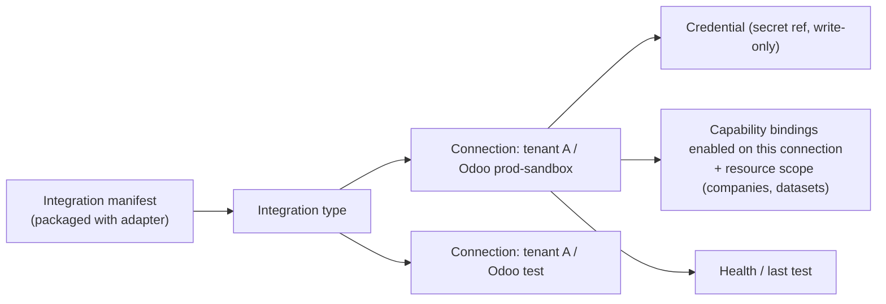

# Integration, connection and credential management

**Date:** 2026-10-06. **Status:** proposed design ([ADR 0012](adr/0012-schema-driven-integration-management.md)); nothing is implemented. Admin pages are confirmed for **Phase 2**. The auth SDK, tenant app registrations and user-delegated connections are detailed in [integration auth SDK](integration-auth-sdk.md) ([ADR 0013](adr/0013-integration-auth-sdk-and-delegated-connections.md)). It extends HLD §5 (domain / capability / binding / connection) and the [UI architecture](ui-architecture.md).

## 1. Goal

Administrators manage every integration (Odoo, CRMs, Google Workspace, BigQuery, MCP servers, future providers) from **generic admin pages**: connections, settings, credentials, auth flows, scopes, health and which capabilities each connection may serve. Two properties must hold:

1. **No UI or kernel code knows any provider.** A new integration is an adapter package plus its manifest. The admin UI renders it from the manifest's schemas and needs no change.
2. **Secrets never reach the UI, the model, the driver, events, logs or evidence.** They are write-only from the admin UI and are resolved only inside the adapter at call time.

## 2. Research basis (2026-10)

| Practice | What e-agent takes from it |
|---|---|
| Airbyte connector spec: `connectionSpecification` is JSON Schema; `airbyte_secret` marks fields obfuscated in UI/API; declarative OAuth (`advanced_auth`) needs no connector code for the flow | A JSON Schema connection spec with secret annotations, and auth methods declared in the manifest |
| n8n credential types: credentials are separate reusable objects; generic types (header auth, OAuth2); a single master encryption key is a known weak point | Credentials are separate from connection settings. Use envelope encryption with a key held outside the database, and keep the key replaceable |
| Nango: managed OAuth/API-key/refresh for many APIs, self-hostable (Elastic License) | An option *behind* our credential port. It is not adopted in the MVP; its license and fit need review |
| RFC 9700 (OAuth 2.0 Security BCP, Jan 2025) | Authorization code + PKCE only, exact redirect URIs, `state`, refresh-token rotation, no implicit or password grant |
| MCP authorization (2025-11-25): OAuth 2.1 + PKCE, Protected Resource Metadata (RFC 9728), resource indicators (RFC 8707) | MCP servers can become one more integration type using the same generic OAuth engine |
| JSON Forms: JSON Schema + UI schema with a framework-neutral core and pluggable renderers | Admin forms are rendered from schemas through our own component layer, so themes and custom UIs still work |
| Vault/OpenBao Transit: envelope encryption, keys never leave the KMS | A `SecretStore` port with local-encrypted, OpenBao/Vault and cloud secret-manager adapters |

## 3. Concepts



| Concept | Owner | Notes |
|---|---|---|
| Integration type | Adapter package (manifest) | Code is admitted by deployment (MVP design §6), never uploaded from the UI |
| Connection | Tenant admin (`tenant_shared`) or the user (`user_delegated`, ADR 0013) | Non-secret settings plus a credential reference; versioned; lifecycle below |
| Credential | `SecretStore` | Write-only from the UI and API; rotation and re-auth |
| Capability enablement | Tenant integration admin | Which admitted bindings this connection may serve, with resource scope |
| Health | Adapter `test_connection` | Read-only, bounded, recorded |

## 4. Integration manifest additions

Every adapter manifest (MVP design §6) adds a provider-neutral `connection` section:

```yaml
integration:
  id: odoo19                       # opaque to UI/kernel
  display: {name_key: "integration.odoo19.name", description_key: "...", icon: "assets/icon.svg"}
  i18n: "i18n/"                    # packaged message catalogs (vi, en)
  connection_schema: "schemas/connection.schema.json"   # JSON Schema 2020-12, non-secret + secret fields
  ui_schema: "schemas/connection.ui.json"               # optional: groups, order, help keys
  auth_methods:
    - type: api_key                # api_key | basic | oauth2_authorization_code | oauth2_client_credentials
      secret_fields: [api_key]     #   | service_account_json | mtls | none
  oauth: null                      # for oauth2_*: endpoints, scopes, PKCE required, token rules (declarative)
  resource_scope_schema: "schemas/scope.schema.json"     # e.g. allowed companies / datasets
  test_connection: {capability: "integration.health.v1", timeout_s: 10}
  provides_bindings: ["odoo19.procurement.purchase-order.create-draft", "..."]
```

Rules:

- In `connection_schema`, secret fields carry `"x-e-agent-secret": true` and `"writeOnly": true`. The API never returns their values; it returns only `{set: true, updated_at, updated_by}`.
- Forbidden schema features: remote `$ref`, arbitrary format plugins, and executable defaults. Schemas are validated at admission.
- Display text comes from packaged i18n keys. The UI never hard-codes provider names or logos.

## 5. Connection lifecycle

`draft → configured → verifying → active ⇄ degraded → disabled → revoked`

- `verifying` runs `test_connection` through the gateway with the new settings, before activation.
- Any change to settings, credentials, scope or enabled bindings creates a **new connection version**. The approval digest already covers binding and connection; it now also covers the **connection version**, so pending approvals that relied on the old configuration become stale (MVP design §4).
- `disabled` blocks new invocations immediately. In-flight `UNKNOWN` actions still reconcile, read-only, if possible.
- `revoked` deletes the credential from the `SecretStore`, revokes OAuth tokens at the provider where supported, and keeps the audit history.

## 6. Credentials and auth

| Concern | Design |
|---|---|
| Storage | `SecretStore` port. Adapters: `local-encrypted` (dev/MVP: envelope encryption, key-encryption key from OS keyring or a file outside the repo and database), `openbao`/`vault` (Transit or KV), cloud secret managers. The database stores only `secret_ref` |
| Use | At dispatch the gateway resolves a short-lived `CredentialHandle` for exactly one connection and passes it to the adapter. The driver, model, UI, events and evidence never see it |
| OAuth | One generic server-side OAuth engine driven by the manifest: authorization code + PKCE, `state` bound to admin session and connection draft, exact registered redirect URI, refresh rotation, revocation on delete (RFC 9700). The admin UI only opens the URL the API returns |
| Service identities | Service-account JSON or keys are uploaded write-only. Prefer workload identity or federation where the provider supports it |
| Rotation | Admin "replace credential" creates a new connection version; `test_connection` must pass before it becomes active |
| Separation of duties | New role `integration_admin`, distinct from requester and approver. Connection changes require recent re-authentication (step-up). The model can never call admin APIs |

## 7. Admin API (generic)

| Endpoint | Purpose |
|---|---|
| `GET /v1/admin/integrations` | Admitted integration types with manifests, schemas and i18n |
| `POST/GET/PATCH /v1/admin/connections` | Create, list and update connections (non-secret settings; expected version required) |
| `PUT /v1/admin/connections/{id}/credentials` | Write-only secret fields; response has no values |
| `POST /v1/admin/connections/{id}/oauth/start` → `GET /oauth/callback` | Generic OAuth flow |
| `POST /v1/admin/connections/{id}/test` | Run `test_connection`; result recorded |
| `PUT /v1/admin/connections/{id}/bindings` | Enable bindings and set resource scope (validated by `resource_scope_schema`) |
| `POST /v1/admin/connections/{id}/disable` / `revoke` | Lifecycle |
| `GET /v1/admin/audit?subject=connection:{id}` | Who changed what and when (no secret values) |

All admin changes are written as audit events in the same transaction as the change.

## 8. Admin UI

- `@e-agent/admin` is another L8 app on the shared layers (client, ui-core, tokens, components). Re-theming, re-layout and custom admin UIs work exactly as for the agent UI.
- A **schema-form renderer** at L6 renders `connection_schema` + `ui_schema` with the default components. Candidate: JSON Forms core with our own renderers; the choice is confirmed in a spike. Secret fields render as "set / not set / replace" inputs that never show a value.
- Pages: integration catalog → connection list → connection detail (settings, credential status, auth, scope, enabled capabilities, health, history).
- **Architecture gate:** UI packages may not contain provider identifiers. A CI denylist (`odoo`, `bigquery`, `google`, `salesforce`, …) runs over `ui/` sources, and only manifest-provided data may name a provider.

## 9. Fast extension without UI or kernel changes

| Change | What is touched |
|---|---|
| New provider for an existing capability (e.g. another ERP for `procurement.purchase-order.create-draft.v1`) | New adapter package + manifest + conformance tests; admin and agent UI unchanged |
| New auth method on an existing provider | Manifest `auth_methods` (plus the OAuth engine config if OAuth) |
| Swap secret storage (local → OpenBao → cloud KMS) | `SecretStore` adapter + migration job; nothing else |
| Swap OAuth handling to a managed service (e.g. Nango) | Credential/OAuth adapter behind the same port; license review first |
| New integration type: MCP server | One generic MCP adapter + MCP OAuth (RFC 9728/8707); tools admitted per server through capability descriptors, never auto-exposed |

Installing new adapter *code* stays a deployment action with artifact admission (MVP design §6). Admin pages configure **admitted** integrations; they do not upload or execute code.

## 10. MVP versus later

| In MVP (seams only) | Later (Phase 2) |
|---|---|
| Manifest `connection` section and schemas for the Odoo and BigQuery adapters | Admin UI pages and schema-form renderer |
| `SecretStore` port + `local-encrypted` adapter; profiles carry only `secret_ref` | OpenBao/Vault/cloud adapters |
| Connection records and versions in PostgreSQL; connection version in the approval digest | Generic OAuth engine; MCP integration type |
| `test_connection` for Odoo and BigQuery | `integration_admin` role with step-up auth; full admin API |
| UI provider-identifier gate | Managed OAuth service evaluation |

The MVP has no OAuth provider: Odoo uses an API key and BigQuery uses a service identity. The OAuth engine is therefore not on the MVP critical path, but its contracts are defined now so later additions need no redesign.

## 11. Verification

- A fixture integration whose manifest has never been seen by the UI renders, validates and saves a connection through the admin API and a generic form.
- No API response, event, log line, trace or evidence bundle contains a secret field value (scan against seeded canary secrets).
- Changing a connection's credential or scope makes a pending approval stale.
- A disabled connection blocks a new invocation before any provider call.
- The OAuth engine rejects a missing or mismatched `state`, a non-registered redirect URI and a flow without PKCE.
- The provider-identifier denylist fails CI when a provider name is added under `ui/`.
