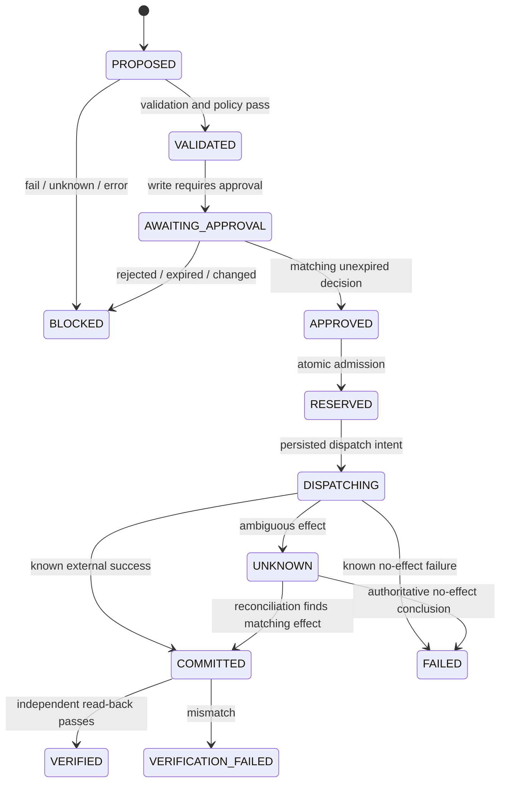

# e-agent MVP: detailed design

**Status:** implementation specification, not implemented. **Date:** 2026-10-06.

This document specializes the [high-level design](high-level-design.md). It selects a bounded procurement demo and independent adapter distributions, superseding the broader first-demo alternatives in [research 06](../research/06-erp-mvp-delivery-plan.md). Numbers below are initial demo defaults and acceptance targets, not measured results or production SLAs.

## 1. Deliverable and scope

A real model-driven agent reads synthetic procurement data, proposes a purchase order, receives executable ontology findings, repairs or stops, requests approval, creates one draft purchase order in Odoo and verifies the result by a separate read-back.

Three required demonstrations:

1. A valid request produces exactly one correct draft PO after explicit approval.
2. A deliberately invalid proposal is blocked with rule IDs/evidence; a live agent may repair it, but a scripted injection is labeled as such.
3. Changed/expired approval or an uncertain write result prevents unsafe replay and produces an inspectable blocked/unresolved outcome.

The product does not confirm orders, receive stock, post invoices, send email or trigger payment. Live order acceptance, CRM and Google integrations are out of scope. Non-ERP fixture plugins prove boundaries only. CLI plus a thin application API is sufficient; no web UI is required.

Use one synthetic tenant, company, warehouse, currency and unit of measure in the live demo; explicitly reject requests outside that profile. All records still carry tenant and connection scope. One actor can have request and approve roles locally, but model output can never serve as approval.

## 2. Procurement semantics and fixture

Baseline scenario: demand is 12 units, available stock is 5, and existing inbound supply is zero. Required purchase quantity is 7. Offer A is approved and meets delivery/budget bounds; offer B is unapproved. These are synthetic fixture facts, not assumptions about arbitrary Odoo installations.

Initial rules:

| ID | Condition | Evidence |
|---|---|---|
| PR-001 | Product, supplier, offer and source references are present and resolve in scope | Catalog and fixture/source IDs |
| PR-002 | Quantity equals `max(demand - available_stock, 0)` under the demo's no-inbound assumption | Demand and stock snapshot |
| PR-003 | Selected supplier/offer is approved and offer belongs to product/supplier | Versioned approved-offer fixture or mapped ERP facts |
| PR-004 | Quantity is positive; unit/currency match the scenario; line subtotal is within budget | Typed decimal quantities/prices and scenario limits |
| PR-005 | Offer delivery date meets the requested bound | Offer and requested dates |
| PR-006 | Observed resources and connection belong to the authorized tenant/company scope | Host context and provider mappings |

PR-006 includes an authorization check outside SHACL; passing a shape never grants access. Missing/ambiguous facts produce `UNKNOWN` validation or a clarification request, never invented defaults. Zero shortage completes with a verified no-op and creates no PO. Reject taxes, unit conversion, discounts and multi-line/multi-currency cases until explicitly designed; fixture totals use a declared tax-free subtotal basis.

Approved-offer status may come from a reviewed synthetic fixture if absent from the chosen ERP schema. Record that source explicitly; do not imply it is an Odoo-native field. At setup, verify the chosen Odoo version/API can create/read the required draft object and has no confirmation automation enabled for this sandbox.

The demo does not guarantee transactional inventory allocation. Refreshing stock before dispatch reduces stale decisions but cannot atomically lock external stock through the local DB. If a resource changes, block and replan; stronger inventory invariants require provider-side conditional operations or reservations beyond this scope.

## 3. Planned repository layout

```text
apps/server/                        # e_agent_server: bootstrap, CLI, API, worker
packages/contracts/                 # e_agent_contracts: portable records
packages/plugin-sdk/                # e_agent_plugin_sdk: public ports and manifests
packages/kernel/                    # e_agent_kernel: state, gates and orchestration
packages/domain-erp/                # e_agent_domain_erp: public DTOs, rules, resources
packages/adapter-agent-pydantic/     # candidate; name depends on spike result
packages/adapter-odoo/               # e_agent_adapter_odoo
packages/adapter-postgres/           # e_agent_adapter_postgres, migrations
packages/adapter-shacl/              # e_agent_adapter_shacl
profiles/                           # non-secret local-demo and test profiles
tests/architecture/                 # imports, independent artifacts
tests/conformance/                  # reusable port/plugin behavior
tests/end_to_end/                   # isolated live integration tests
evals/                              # scenarios, evaluators and complete reports
docs/                               # designs, later ADRs and runbooks
research/                           # source research
```

Each distribution has `pyproject.toml`, `src/<import_root>/`, tests and declared dependencies. Domain ontology, shapes, manifest, rule inventory and competency fixtures are packaged resources. Read them through resource APIs, not current working directory. Generate wire-schema snapshots from one authoritative DTO definition; do not hand-maintain divergent schema copies.

Do not create speculative empty CRM, Google or knowledge packages. A small non-ERP fixture plugin can live in test fixtures and build its own test artifact.

## 4. Contracts and normalization

Wire records use explicit schema versions, UTC timestamps, UUID-like opaque internal IDs and tenant-qualified external references. Money/quantity cross wire boundaries as normalized decimal strings with currency/unit metadata, never binary float. Commands reject unknown fields. Event readers follow a documented compatibility policy; unknown event versions are quarantined rather than interpreted as current.

| Record | Required information |
|---|---|
| TaskContext | Run, tenant, trusted principal, authorized resource scope, deadline, budgets |
| CapabilityDescriptor | Contract ID/version, input/output schemas, read/write effect, feature requirements |
| CapabilityBinding | Binding ID, capability contract, plugin/version, connection ID and supported features |
| ConnectionDescriptor | Tenant, provider, allowed company/resources, secret reference; no secret value |
| EvidenceRef | Source identity/revision or observed snapshot digest, locator, observed time, scope and provenance |
| CandidatePlan | Plan ID/revision, typed capability proposals, evidence refs, expected effects |
| ValidationResult | PASS/FAIL/UNKNOWN/ERROR, rule/version, expected/observed values, evidence refs |
| ApprovalRecord | Actor, decision, exact action digest, scope, policy version, issue/expiry times |
| ActionRecord | Logical operation ID, binding, canonical arguments, digest, state/version, attempts |
| ExecutionReceipt | COMMITTED/FAILED/UNKNOWN, external IDs, provider correlation, sanitized error and timestamps |
| OutcomeReport | VERIFIED/FAILED/UNKNOWN, acceptance checks, observed ERP state refs and verifier version |
| RunEvent | Event/schema ID, tenant/run/action IDs, sequence, timestamp, correlation and typed payload |

`COMMITTED` means the provider operation is known to have completed; it does not mean the business outcome is correct. Only the independent verifier can mark the outcome `VERIFIED`.

The generic action envelope contains a capability-specific payload validated by its registered schema. Domain fields such as supplier and quantity belong to `domain-erp.api`, not generic contracts. Kernel routes envelopes without understanding those fields.

### Approval digest

Define one versioned canonical serialization: explicit allowed types, sorted object keys, canonical decimal strings, UTC timestamp representation, no NaN/Infinity, no ambiguous numeric coercion, and retained array order. Hash UTF-8 bytes with SHA-256. Include a digest-format version.

The digest covers tenant/requester, capability contract, binding and connection, normalized arguments, expected effects, material source snapshot refs, ontology/rule versions and policy version. Approval actor/expiry are recorded alongside the digest. Display the same normalized proposal used for hashing. Material resource changes, changed arguments or changed policy invalidate eligibility and require revalidation/reapproval. A refreshed observation timestamp alone is not a material change: preserve the observation record separately and compare the provider revision or canonical relevant-fact digest. Do not hash arbitrary framework messages or raw provider responses as the plan identity.

## 5. SDK responsibilities and wiring

| Port | Initial operation/semantics | Implementation |
|---|---|---|
| AgentDriver | Advance with authorized observations; return proposal, clarification, answer or bounded continuation | Selected framework adapter |
| CapabilityProvider | Register immutable definitions and permitted bindings | ERP domain + Odoo adapter through host |
| PlanValidator | Validate typed facts against specified bundle; return canonical findings | Domain normalizer + SHACL adapter |
| ActionExecutor | Execute an admitted invocation; expose reconcile/read support and timeout semantics | Odoo adapter |
| EvidenceRetriever | Return authorized facts with source/snapshot refs and completeness | Direct ERP/fixture implementation initially |
| OutcomeVerifier | Compare independent observations with domain acceptance criteria | Domain verifier using authorized read port |
| RunStore/UnitOfWork | Optimistic state updates, reservations, approvals, events and local atomic commit | PostgreSQL adapter |
| PolicyEvaluator | Deterministic permit/deny/approval plus obligations/version | Trusted platform module |
| EventObserver | Optional redacted observation of committed events | Logging/export integration |

The domain normalizer constructs a backend-neutral validation dataset: typed facts/statements plus ontology/shape artifact references. It may use domain vocabulary but not RDF library objects. The SHACL adapter maps that dataset to its engine and returns canonical findings; it does not import ERP implementation modules. Domain rule assets are the semantic source of truth, with no copied rule logic hidden in prompts/UI.

Bootstrap wires dependencies and gives each plugin only its required services. Domain verification may receive a scoped read port; it never receives approval issuance or direct DB access. Plugin factories must not import sibling implementations to discover services.

## 6. Plugin registration and configuration

Initial discovery uses installed distribution metadata and a versioned entry-point group such as `e_agent.plugins.v1`. A packaged static manifest describes plugin ID, artifact version, supported SDK API range, factory, provided/required capabilities and settings schema. Factory registration must agree with the admitted manifest.

Startup sequence:

1. Load a validated non-secret profile and operator-provided secret references.
2. Read installed metadata and manifests without loading entry points.
3. Match enabled artifact/version/digest against the deployment's approved artifact inventory; verify installed contents against the build inventory before importing. A hash proves identity only relative to that trusted inventory, not publisher trust by itself.
4. Validate API/dependency compatibility, settings, capability definitions and required bindings.
5. Load admitted factories; register bindings; reject conflicting definitions/duplicate binding IDs.
6. Initialize with scoped services, perform bounded health checks and publish the ready registry.

No hot installation or arbitrary third-party plugins in MVP. Upgrade requires redeployment; drain active runs or retain their compatible execution path. Revoked plugins block new invocation regardless of a run's pinned version.

The profile declares enabled plugins, default authorized connection, model/driver, budgets, sandbox identity, policy/rule bundle and evidence retention settings. A model-supplied connection ID is untrusted until resolved against host scope. Missing or ambiguous bindings fail before any provider call. Unknown plugin IDs fail startup; disabled plugin code must never be imported during discovery.

## 7. Run and action state machines

Run states: `CREATED`, `RUNNING`, `WAITING_INPUT`, `WAITING_APPROVAL`, `VERIFYING`, `NEEDS_RECONCILIATION`, `SUCCEEDED`, `FAILED`, `CANCELLED`. Runs have a monotonic revision for compare-and-swap updates. Recoverable waits are persisted; terminal transitions require recorded reasons/outcomes.

Action states:



Read actions use the same authorization/audit gateway but can move from VALIDATED to RESERVED without approval when policy permits. A blocked proposal is immutable; repair creates a new revision/action linked to it. UNKNOWN remains nonterminal for reconciliation; it cannot be blindly replayed. Verification temporarily unavailable keeps the run unresolved rather than treating a committed action as safe to retry.

Cancellation prevents undispatched actions. Once dispatch may have occurred, cancellation cannot assert rollback; record cancellation intent and reconcile the external effect. A cancellation with unresolved effects keeps the run in NEEDS_RECONCILIATION.

## 8. End-to-end execution

1. Authenticate/local-map the requester; validate sandbox/connection scope; persist task and budgets.
2. Driver requests reads. Gateway authorizes and records them; executor returns typed facts and source evidence.
3. Driver proposes a draft PO. Domain validation constructs facts and SHACL findings; policy separately evaluates execution eligibility.
4. Return findings to the driver within repair budget. Missing data produces a question or safe stop.
5. Persist a valid normalized proposal and expose its diff, evidence, rules and digest for human approval.
6. Approver explicitly approves that revision. Resume checks current policy/grants, expiry, artifact revocation and material source state.
7. Atomically reserve the action/logical operation and record the mandatory pre-dispatch event. Dispatch only after that transaction commits.
8. Persist DISPATCHING before the network call; invoke the scoped Odoo adapter with correlation/idempotency information supported by the deployment.
9. Persist the receipt and state/event atomically. On uncertain transport/process outcome, move to UNKNOWN and reconcile.
10. Verifier independently reads the resulting PO through the gateway. Compare supplier, product, quantity, unit, currency, subtotal, draft state and operation correlation; check for duplicates in the scoped synthetic run namespace.
11. Emit OutcomeReport and terminal run result only when justified; export structured evidence.

Immediately before dispatch, refresh material stock/offer facts and re-evaluate policy. Matching snapshots permit the approved action to proceed; changed material facts require a new proposal. The design explicitly retains the external race limitation described in section 2.

## 9. Persistence and concurrency

Proposed logical tables, all accessed through RunStore rather than directly by domains:

| Table | Key data and constraints |
|---|---|
| runs | Tenant/run key, trusted actor, task, state/revision, budgets, driver continuation reference |
| proposals | Tenant/run/plan revision, canonical payload/digest, validation bundle refs; immutable |
| evidence | Tenant/evidence ID, source/snapshot metadata, authorized payload/reference, retention metadata |
| approvals | Tenant/approval ID, action digest, actor/decision/expiry/policy; append-only decisions |
| actions | Tenant/action key, logical operation key, binding, state/revision, lease/fencing token |
| operation_reservations | Unique tenant/connection/logical-operation key, admitted action/digest, reservation status |
| action_attempts | Action/attempt key, dispatch intent, provider correlation, timestamps and error class |
| receipts | Action/attempt, effect status, external references and sanitized response evidence |
| outcome_reports | Run/action, verifier/version, checks and observed evidence |
| run_events | Unique tenant/run/sequence and globally unique event ID; no secret payloads |

Composite scope constraints prevent cross-tenant references. A unique `(tenant_id, connection_id, logical_operation_id)` in operation_reservations prevents two local reservations for the same intended operation. The host assigns logical operation IDs and carries them across proposal repairs/resume; the model cannot mint a new ID to evade deduplication. Several immutable proposal/action revisions may refer to one logical operation, but only one can be admitted at a time. After dispatch may have occurred, retain the reservation and never transfer it to a replacement proposal automatically. API request idempotency keys are a separate scope: same actor/tenant/key and same request return the existing run; same key with different payload returns conflict. A newly submitted equivalent business request with a different key is not automatically recognized as the same intent; that requires a domain-specific deduplication policy beyond this MVP.

Use short local transactions for compare-and-swap state transitions, approval eligibility/reservation and event insertion. Never hold a DB transaction open across a model or ERP call. Each action attempt has a worker lease/fencing token; stale workers cannot commit newer local state. This fencing does not cancel a network call already accepted by Odoo.

`run_events` is the transactional source for later observers. No broker/outbox dispatcher is required initially. If external event delivery is added, insert outbox records in the same transaction and implement idempotent delivery/consumption; do not add a non-atomic second event write.

### Crash/retry rules

| Failure point | Recovery |
|---|---|
| Before reservation commits | No external dispatch; retry admission if still eligible |
| RESERVED, no dispatch intent, expired worker | Reacquire with fencing; recheck approval/policy/resources before dispatch |
| DISPATCHING or worker lost around network call | Treat as possibly executed; reconcile before another write |
| Provider succeeded, local receipt persistence failed | Recover by external correlation/read-back; do not infer failure from missing receipt |
| Receipt committed, verifier unavailable | Retry read-only verification within bounds; retain committed action |
| Approval expires during wait | New explicit approval required before dispatch |
| Cancel/revoke during external call | Record intent, block further actions, reconcile; do not claim effect was prevented |

Prefer provider-side idempotency when the selected Odoo deployment can enforce it. Do not assume standard RPC create is idempotent. A searchable correlation field alone is not a uniqueness guarantee. If atomic external uniqueness is unavailable, MVP uses one serialized writer per sandbox connection and never auto-retries ambiguous writes. Reconciliation may conclude UNKNOWN indefinitely; an operator investigates before any replacement action. Duplicate/collision matches are incidents, not automatic success. This scope does not promise exactly-once execution.

## 10. Agent behavior and budgets

Pydantic AI is a candidate, not an irrevocable dependency choice. Before selecting it, demonstrate external/deferred tool requests, correlation-preserving resume, cancellation/error mapping, structured proposals and no route to raw ERP execution. If the spike fails, change the driver candidate and record the decision without changing kernel semantics.

Initial per-run defaults: 12 driver turns, 20 read calls, 2 validation repairs, 1 admitted business write, 120 seconds of cumulative active execution time excluding human wait, and a configured token budget. Approval expires after 15 minutes. Separate configurable deadlines apply to model and provider calls. Budget exhaustion stops new work; a possibly dispatched write still requires reconciliation.

Check budgets before each step and record usage afterward; record cancellation/overshoot if a provider cannot enforce the exact token/time limit. Model text, extracted documents and tool responses cannot raise budgets, grant permissions or choose hidden credentials.

Continuation is opaque and tied to driver/version. Persist only what is necessary, redact secrets, and apply retention. The durable business ledger remains sufficient to determine whether actions may have occurred even if the framework continuation cannot be resumed.

## 11. Ontology and evidence implementation

Package a small vocabulary for Product, Supplier, Offer, Demand, StockObservation and DraftPurchaseOrder, plus shapes and named rules PR-001 through PR-006. Pin ontology, mapping and validator versions in every ValidationResult. Shape evaluation ERROR/UNKNOWN blocks writes just as FAIL does, with a distinct diagnosis.

Use one reviewed rule inventory and executable assets. Prompt explanations may summarize rules but cannot be the enforcement source. Procedural equivalents belong only to comparative test/evaluation controls, not a second unsynchronized production rule path.

Competency fixtures must answer: which facts support shortage; which offer is allowed; why a proposal failed; what changed in a repair; who approved which digest; which ERP record proves the final state; whether an operation was duplicated. A fixture with a revoked evidence scope must not be served to the agent. Graph infrastructure is unnecessary to answer this first set.

Evidence export includes scenario ID, environment class (fixture/live), model/driver/plugin versions, ontology/rules, proposals/findings, approvals, sanitized action attempts, receipts, final checks and failure classification. Do not store API keys, bearer tokens, hidden chain-of-thought or unredacted provider debug dumps. Raw export is authorized; local file permissions and retention apply.

## 12. Application surface

These are planned API contracts, not available endpoints yet. CLI calls the same application services to avoid a second business implementation.

| Operation | Behavior |
|---|---|
| `POST /v1/runs` | Accept task/scenario and permitted connection hint; trusted identity comes from host; idempotency key required |
| `GET /v1/runs/{id}` | Scoped run state, pending action, outcome and latest sequence |
| `GET /v1/runs/{id}/events?after_sequence=N` | Authorized cursor-based event polling |
| `POST /v1/runs/{id}/inputs` | Supply requested clarification with expected run revision |
| `POST /v1/runs/{id}/approvals` | Approve/reject exact action ID/digest and expected revision; actor derived from authenticated context |
| `POST /v1/runs/{id}/cancel` | Persist cancellation intent and return whether effects remain unresolved |
| `POST /v1/runs/{id}/reconcile` | Operator-authorized, read-only external reconciliation; no write retry endpoint |
| `GET /v1/runs/{id}/evidence` | Authorized redacted JSON bundle |
| `GET /health/live`, `GET /health/ready` | Process liveness versus required dependency/plugin readiness |

Use structured errors with code, correlation ID and safe details: INVALID_REQUEST, CONFLICT, APPROVAL_STALE, VALIDATION_BLOCKED, DEPENDENCY_UNAVAILABLE, BUDGET_EXCEEDED and ACTION_UNRESOLVED. Unauthorized resource access must not expose cross-tenant existence. Identity/tenant fields in request bodies cannot override host identity.

Local demo mode binds to loopback and explicitly maps an operator identity/roles; it is not a production auth mechanism. A remotely accessible deployment must supply proper authentication and authorization before exposure.

## 13. Verification and acceptance

| Gate | Required evidence |
|---|---|
| Architecture | Import rules reject kernel→domain/adapter and adapter→kernel internals; no cross-repo imports |
| Independent artifacts | Each wheel installs/tests outside editable workspace; ontology resources load without repository cwd |
| Registry | Disabled plugin import marker absent; incompatible manifest/duplicate binding rejected before activation |
| Domain neutrality | Non-ERP test plugin runs with no ERP/Odoo installed; adding it does not edit kernel |
| Binding scope | Two fixture connections select correctly; wrong tenant and ambiguous target fail before execution |
| Validation | Every named rule has positive/negative/missing-data cases with evidence; engine failure blocks write |
| Approval | Changed payload, source revision, expired decision, revoked scope and concurrent duplicate resume are rejected safely |
| Persistence/recovery | Fault injection around reservation, dispatch and receipt; ambiguous writes never blindly replay |
| Outcome | Wrong quantities/state, duplicates and unavailable reads cannot report VERIFIED |
| Live demo | A real model creates the correct draft in the designated sandbox after approval and independent read-back |
| Evidence | All attempts classified fixture/live/infrastructure failure; versions and rule provenance present; secrets absent |

Initial development evaluation: at least five deterministic scenarios (valid shortage, zero shortage, unapproved offer, over-budget proposal, missing/stale facts) and three live trials of the valid scenario. Record all results and failures. Release gate requires all deterministic safety/architecture checks passing and three verifier-passing live valid trials; if unmet, report incomplete instead of selecting only a successful showcase. This small set does not establish broad ERP reliability or statistical superiority.

Inject negative proposals when the model does not naturally produce them; label them mechanism tests. Ontology/procedural parity is expected for equivalent rules. Comparative superiority requires a separately controlled experiment; do not change the experiment's conditions or evidence to improve this product demo.

Before completion, another developer must reproduce setup, valid run, blocked proposal and unresolved-action path from the implementation runbook. Include actual tested versions, executable commands, artifact IDs and known limitations then; none are invented here.

## 14. Implementation sequence and unresolved decisions

1. **Bootstrap:** pin Python/tooling and dependency versions; choose model/Odoo sandbox/API; establish sandbox marker, artifact inventory and reset process. Create workspace and package import/wheel gates.
2. **Contract slice:** implement typed records, fake ports, registry, domain rules/resources and deterministic verifier fixtures. Complete one no-network run through real kernel services.
3. **Driver spike:** prove deferred execution and resume; record framework selection. Avoid building a second generic agent loop.
4. **Persistence and safety:** implement DB migrations, reservation, approvals, event atomicity, budgets and recovery tests.
5. **Live adapter:** map chosen Odoo schema, qualify correlation/reconciliation limitations, execute draft-only workflow in synthetic sandbox.
6. **Demo/evaluation:** run all gates, collect complete evidence, document setup/reset/recovery and five-minute demonstration script.

Decisions still needed during implementation: exact Odoo version/API; supported correlation/uniqueness mechanism; chosen model/version and credentials provisioning; exact framework version; package build backend; local secret handling and retention defaults. Each has a bounded verification task above. Production IAM, HA, disaster recovery targets and graph engine selection belong to later scope and must not be fabricated as completed MVP capabilities.
