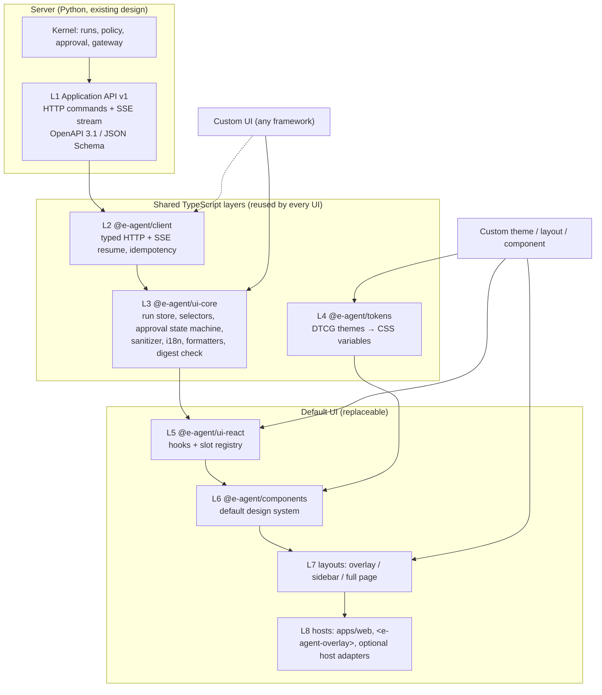

# UI architecture: layered, themeable and replaceable

**Date:** 2026-10-06. **Status:** proposed design ([ADR 0011](adr/0011-layered-replaceable-ui.md)); nothing is implemented. It refines the overlay UI that [ADR 0001](adr/0001-local-mvp-scope.md) puts in the MVP and builds on the stream contract in [ADR 0007](adr/0007-run-event-stream-contract.md).

## 1. Goal

e-agent ships a **default UI** in two forms: a standalone web app and an embeddable overlay. A deployer must be able to:

1. **re-theme** it (colors, typography, density, light/dark, brand) without code;
2. **re-layout** it (floating overlay, docked sidebar, full page; rearrange or hide panels) through configuration;
3. **replace individual components**, such as a different timeline or evidence viewer;
4. **build an entirely different UI**, in any framework,

while **reusing every layer below the one they change**.

**System neutrality.** e-agent is an enterprise agent, not an add-on to any one business system. The default UI runs standalone and can be embedded into *any* web page. No UI layer depends on Odoo or any other provider. Integration with a specific system's UI is an optional **host adapter** at L8, in the same way that Odoo is only a provider adapter on the backend. The core never needs one. No layer may weaken the safety rules. Approval, policy and validation stay on the server, and every UI talks to the same API.

## 2. Research basis (2026-10)

| Finding | Design consequence |
|---|---|
| Headless component libraries separate behaviour from presentation. Zag.js/Ark UI use framework-agnostic state machines; React Aria provides accessible behaviour hooks. | Put UI *behaviour* in a framework-free core and keep presentation swappable. Build default components on an accessible headless primitive library. |
| The W3C Design Tokens Community Group format reached its first stable version, **2025.10**. It supports themes, aliases and multi-brand sets. | Themes are DTCG token files compiled to CSS custom properties. They are not hard-coded CSS. |
| CSS custom properties inherit through Shadow DOM; `::part()` exposes structural styling; React 19 supports custom elements. | The embeddable overlay is a custom element with Shadow DOM isolation. Its public styling API is tokens plus parts. |
| Chat UI kits (e.g. assistant-ui) split primitives, runtime and backend adapters, and offer an "external store" runtime for app-owned state. | Same layering here: the run store is ours, and UI kits are optional at the component layer. |
| AG-UI standardizes agent→UI event streams (about 16 event types, transport-agnostic). A2UI (v0.9, public preview) lets agents send declarative UI from a host-trusted component catalog. MCP Apps render agent UIs in iframes. | None of these becomes the canonical contract (ADR 0007). AG-UI may become an optional outbound adapter. Agent-generated UI (A2UI/MCP Apps) is out of MVP scope and never allowed for approval surfaces. |
| BFF practice: one API per client surface, typed contracts generated from server models (OpenAPI 3.1). | The e-agent server is the single BFF for all UIs. TypeScript types are generated from the Pydantic DTOs, never hand-written. |

## 3. Layers



| Layer | Package | Responsibility | Must not |
|---|---|---|---|
| L1 API | `e-agent-server` | Commands, snapshots, SSE (ADR 0007), `ApprovalPresentation` | Depend on any UI |
| L2 Client | `@e-agent/client` | Generated types; fetch wrapper with auth, correlation and idempotency key; SSE client with `Last-Event-ID` resume, dedup and `snapshot_required` handling; typed errors | Import DOM-rendering or framework code |
| L3 UI core | `@e-agent/ui-core` | Event-sourced **run store** (reducer: events → view state); selectors (timeline, pending approval, evidence, outcome); **approval state machine**; markdown/link **sanitizer** policy; i18n catalogs (vi, en); decimal/currency/date formatters; JCS digest verification (ADR 0006) | Import React or other frameworks; call `fetch` directly (only via L2); contain business rules |
| L4 Tokens | `@e-agent/tokens` | DTCG 2025.10 source; built CSS variables plus TS constants; default `light`, `dark`, `high-contrast` themes | Contain component code |
| L5 React bindings | `@e-agent/ui-react` | Hooks (`useRun`, `useTimeline`, `usePendingApproval`, `useComposer`); **slot registry** for component overrides | Hold state outside L3 |
| L6 Components | `@e-agent/components` | Default accessible components built on headless primitives, styled only via tokens | Read raw API responses; hard-code colors or spacing |
| L7 Layouts | `@e-agent/layouts` | Layout presets composed from named slots | Contain domain logic |
| L8 Hosts | `apps/web`, `@e-agent/overlay-element`; optional per-system host adapters | Bootstrapping, auth/session bridge, generic `HostContext` hints, CSP | Grant permissions from host context; leak system-specific types into L1–L7 |

Dependency direction is strictly downward (L8 → L1). It is enforced with dependency-cruiser or ESLint boundary rules, the same way import-linter enforces the Python side.

## 4. Key contracts

### 4.1 API and generated types (L1 → L2)

- Pydantic DTOs in `e-agent-contracts` are the single source. CI generates OpenAPI 3.1 and JSON Schema, then generates the TS types. A schema snapshot diff fails CI on unreviewed changes.
- `RunEvent` is a discriminated union on `type`, versioned by `schema_version`. **Forward compatibility:** ui-core shows an unknown event type as a generic "unsupported event" item and re-fetches the run snapshot. It never guesses the event's meaning.
- `GET /v1/runs/{id}` returns a server-side **run snapshot** that is enough to render the full current state. Events are deltas on that snapshot.

### 4.2 `ApprovalPresentation` (server-owned, safety-critical)

All UIs must show the same approval content, so the server produces it:

```text
ApprovalPresentation {
  action_id, run_revision, digest ("jcs-sha256-v1:…"), expires_at,
  capability_id, binding_display, connection_display,
  canonical_proposal,                 # the exact digest input
  material_fields: [{path, label_key, value, previous_value?, changed: bool}],
  findings: [{rule_id, status, message_key, evidence_refs}],
  policy_obligations: [...]
}
```

ui-core recomputes the JCS digest of `canonical_proposal` and refuses to enable "Approve" on a mismatch. The approve command sends `action_id`, `digest` and `expected_revision`, and the server revalidates regardless.

### 4.3 Approval state machine (L3)

`idle → reviewing → confirming → submitting → (approved | rejected | stale | expired | error)`. `stale` happens when a new revision or digest arrives while reviewing, and forces re-review. Moving `reviewing → confirming` requires an explicit user action. Keyboard activation needs focus on the control and a confirm step; Enter in the chat composer can never approve.

### 4.4 Slots and layouts (L5–L7)

Named slots: `header`, `composer`, `messages`, `timeline`, `approval`, `evidence`, `outcome`, `connection-status`, `footer`.

| Layout | Use | Default arrangement |
|---|---|---|
| `overlay` | Floating, expandable panel over any page | Collapsed launcher → panel with messages + timeline; approval as a modal layer inside the panel; evidence as a drawer |
| `sidebar` | Panel docked to the left or right edge of whatever page it is on (any web app, intranet portal or the standalone app), pushing or overlapping the content | Full-height column; tabs for chat / timeline / evidence |
| `full-page` | Standalone web app | Three columns: conversation, timeline + approval, evidence |

The `approval` slot may be overridden only by a component that passes the UI conformance suite (§6). Layouts are configured with a JSON layout config (`{layout, slots: {timeline: {hidden}}, order}`), validated against a schema.

### 4.5 Theming (L4)

- Token tiers: **primitive** (palette, type scale) → **semantic** (`color.surface`, `color.text.muted`, `color.status.blocked`) → **component** (`approval.border`). Components use only semantic and component tokens.
- A theme is a DTCG file that overrides semantic or component tokens. It compiles to CSS custom properties under `[data-theme="name"]`.
- Safety-signalling tokens (`status.verified/failed/unknown/blocked`, `approval.material-change`) have minimum contrast checks in CI. A theme cannot make them indistinguishable.
- The overlay custom element exposes the tokens as CSS variables plus `::part(panel|launcher|approval|timeline)`. Host-page CSS cannot leak in through the Shadow DOM.

### 4.6 Hosts and embedding (L8)

| Host | Form | Notes |
|---|---|---|
| Standalone | `apps/web` (Vite SPA, `full-page` layout) | Default and reference UI |
| Any web page | `<e-agent-overlay server="…" theme="…" layout="overlay">` custom element, one script bundle | Shadow DOM; same-origin or allowlisted-origin API; no secrets in attributes or URLs |
| Specific system (optional) | A thin **host adapter** for one system, e.g. a browser-extension content script, an intranet portal snippet, or a system-specific plugin such as an Odoo OWL systray item | Mounts the same custom element and translates the page into a generic `HostContext`; nothing else |

The MVP ships only the first two hosts. Host adapters for particular systems are out of MVP scope and need no change to L1–L7 when added later.

### 4.7 Generic host context

A host may tell the agent what the user is looking at. It does so through one provider-neutral, untrusted hint:

```text
HostContext {
  host_kind: "standalone" | "embedded",
  page_url_origin?,                     # origin only, never full URL with tokens
  resource_hints: [{system_hint, resource_type_hint, external_id_hint}],
  locale?, selection_text? (length-limited)
}
```

The server resolves each hint through the **provider adapters' connection mappings**. For example, `system_hint=odoo` + `purchase.order/42` becomes a tenant-scoped `EvidenceRef` only if an authorized connection exists, and is otherwise dropped. Hints never select credentials, never grant access and never bypass scope. They are treated as untrusted content in prompts (threat model T1).

## 5. Customization tiers

| Tier | What changes | Reused layers | Code needed |
|---|---|---|---|
| T1 Theme | Token values | L1–L3, L5–L8 | None (token file) |
| T2 Layout | Layout preset, slot order and visibility | L1–L6 | Config only |
| T3 Component override | One or more slot components | L1–L5, other components, layouts | Small (React) |
| T4 Custom UI | Everything above L3, or above L2 | L1–L3 (or L1–L2) | Full app, any framework |

A T4 UI that uses `ui-core` inherits the run store, approval state machine, sanitizer, i18n and digest check. A T4 UI that uses only `client` must reimplement those, and the conformance suite still applies.

## 6. UI conformance suite

`@e-agent/ui-conformance` is a Playwright suite that runs against any UI URL. A mock server replays recorded event fixtures. Every default or custom UI that offers approval must pass it:

1. The approval surface shows every `material_fields` entry, marks changed fields, and shows rule findings.
2. Approve is disabled on a digest mismatch, after expiry, and while state is `stale`; a new revision forces re-review.
3. Reconnect after a dropped stream yields no gaps or duplicates and no duplicate command.
4. Model text containing remote images or links causes no network request; links show their full URL.
5. Approval requires explicit focus and confirmation; the composer Enter key never approves.
6. An unknown event type leads to a snapshot refresh, not a crash.
7. Vietnamese and English labels render; there are no layout overflows with long Vietnamese strings.
8. Keyboard-only flow and visible focus work (WCAG 2.2 AA target for the default UI).

Passing the suite is a release condition for a UI. It does not replace the server-side checks.

## 7. Explicit non-goals for the MVP

- Agent-generated UI (A2UI, MCP Apps). If added later, the agent may only reference a host-trusted component catalog, and never for approval or policy surfaces.
- Multiple frameworks for the default UI. React is the only default; other frameworks are T4 custom UIs.
- Runtime plugin loading of UI components from untrusted sources (micro-frontends/module federation).
- AG-UI output. This is an optional later adapter on the server (ADR 0007).

## 8. Verification summary

| Gate | Evidence |
|---|---|
| Layer boundaries | dependency-cruiser rules fail on upward or sideways imports; `ui-core` builds and tests with no DOM or React |
| Contract sync | Generated TS types match the committed OpenAPI snapshot; event fixture round-trip |
| Theming | Swapping theme files changes appearance with zero component diff; contrast checks pass |
| Layout | The three presets render from the same component set; layout config schema validated |
| Replaceability | A minimal non-React **reference custom UI** (vanilla TS or Lit, test fixture only) built on `ui-core` passes the conformance suite |
| Embedding | The overlay element works on a test host page whose aggressive global CSS does not change it |
