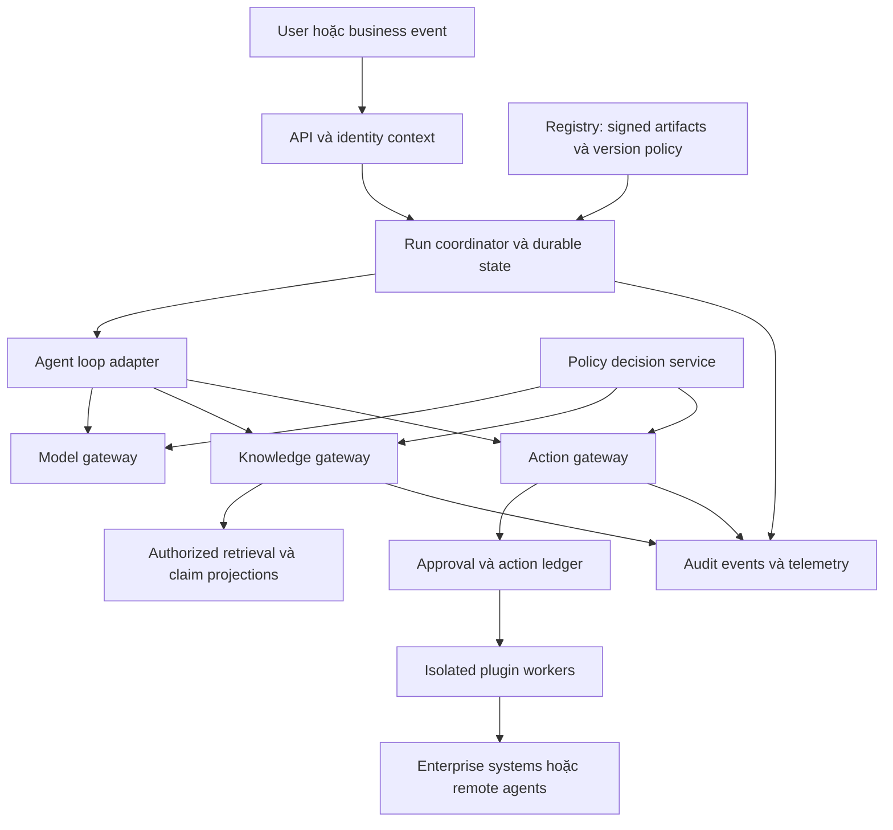

# Kiến trúc agent doanh nghiệp theo plugin

**Trạng thái:** reference design đề xuất, 06/10/2026. Các interface và manifest trong tài liệu là thiết kế cho e-agent, chưa phải API đã triển khai hay đặc tả MCP/A2A.

## 1. Nguyên tắc tổ chức

Xây **modular core với ports/adapters và plugin chạy theo mức tin cậy**. Core giữ run lifecycle, identity context, policy enforcement, action ledger và audit contract. Plugin cung cấp domain logic hoặc cách thực hiện một capability. Cơ chế cưỡng chế quyền không thể bị một plugin thông thường thay thế hoặc bỏ qua.

“Plugin-driven” không có nghĩa mọi thứ phải load bằng Python import trong cùng process. Code cùng process kế thừa quyền process; chỉ sử dụng cho module first-party đã review. Plugin bên thứ ba, parser hoặc code execution chạy trong worker/process/container tách biệt; workload hostile cần boundary mạnh hơn phù hợp threat model.



Mọi đường tới hệ thống bên ngoài phải đi qua cổng kiểm soát tương ứng. Chỉ vẽ gateway trong sơ đồ là chưa đủ: enforce bằng network policy, credentials scope và service identity; plugin không có credential hoặc đường mạng khác để bypass.

## 2. Ba miền trách nhiệm

| Miền | Sở hữu | Không để phụ thuộc |
|---|---|---|
| Control plane | Plugin registry, tenant config, quyền và policy, approval rules, model allowlist, rollout, kill switch | Prompt/model không tự ghi config này |
| Execution plane | Run scheduling, loop, model/tool invocation, retries, sandbox, cancellation, budget | Không dùng chat history làm nguồn duy nhất của trạng thái giao dịch |
| Knowledge plane | Source catalog, ingestion, ontology, assertions, indexes, ACL, retention, lineage | Không coi memory của framework là hệ thống quản lý tri thức chính thức |

Ban đầu các module first-party có thể dùng chung deployment để giảm vận hành. Các trust boundary phải tách thật; chỉ tách thêm microservice khi tải, blast radius hoặc cơ cấu đội yêu cầu.

## 3. Các loại plugin

| Loại | Contract chính | Ví dụ | Quyền mặc định |
|---|---|---|---|
| Model adapter | Input/output có kiểu, capability declaration, usage, cancellation | Hosted LLM hoặc model private | Chỉ endpoint/model được allowlist theo classification |
| Tool/connector | Operation schemas, read/write class, idempotency, resource scope | CRM, ERP, search API | Không có quyền cho tới khi tenant cấp |
| Agent strategy | Propose next step, bounded planning, terminal result | ReAct, plan-and-execute, graph loop | Chỉ đề xuất invocation; không trực tiếp thực thi |
| Workflow/domain pack | State machine, ontology extension, actions, eval fixtures | Procurement, IT service desk | Domain scope được review |
| Knowledge ingestion | Parse, normalize, extract candidate claims | Parser tài liệu hoặc CDC adapter | Ghi staging; không tự publish curated facts |
| Retrieval/memory | Query/recall, evidence bundle, memory proposal | Hybrid, graph expansion, episodic retrieval | ACL bắt buộc, quota và namespace theo tenant |
| Skill package | Versioned instructions, references, scripts | Hướng dẫn lập báo cáo | Hướng dẫn không nâng quyền; script là code cần sandbox |
| Evaluation | Score records và evidence trong môi trường riêng | Domain checker, adversarial suite | Không ghi production hoặc sửa release gate |

Policy evaluator, credential broker và audit sink có thể có adapter do platform team quản trị, nhưng không được mở như extension point tùy ý cho tenant/plugin developer.

## 4. Contract và dữ liệu nền tảng

Thiết kế semantic interface theo tác vụ, tránh một interface `invoke(any) -> any` che mất các bảo đảm.

| Contract | Dữ liệu bắt buộc đề xuất |
|---|---|
| `ExecutionContext` | Tenant, actor, workload identity, delegation chain, run/step ID, purpose, classification, deadline, budget, trace ID |
| `CapabilityDescriptor` | ID/version, input/output schema, permission requirements, effect class, supports cancellation/streaming/idempotency |
| `ActionProposal` | Capability ID, canonical arguments, target resources/versions, expected effects, evidence references, action digest |
| `PolicyDecision` | Allow/deny/approval-required, reason codes, obligations, policy version, expiry |
| `ApprovalRecord` | Actor có thẩm quyền, action digest, scope, resource versions, expiry, decision, authenticated channel |
| `ExecutionReceipt` | Operation ID, request digest, downstream receipt, status, timestamps, error class, reconciliation state |
| `EvidenceBundle` | Claim/chunk IDs, source revisions/locations, ACL decision reference, valid time, retrieval strategy/version |
| `RunCheckpoint` | Canonical task state, pending action IDs, consumed evidence IDs, artifact/version lock, opaque adapter state có schema version |

Identity context do server xác thực và tạo; không lấy `tenant_id`, actor hay quyền từ lời model hoặc payload plugin chưa xác minh. Request DTO, event schema và knowledge schema được version độc lập.

`supports_*` là điều kiện routing và kiểm thử. Không âm thầm đổi model khi model mới thiếu structured output hoặc bỏ qua approval vì adapter không hỗ trợ.

## 5. Manifest ví dụ

Đây là YAML minh họa **custom plugin contract**. Các đường dẫn là tài nguyên trong gói plugin tương lai, chưa tồn tại trong repo. Registry khóa artifact bằng digest thực sau build; manifest không chứa secret.

```yaml
manifest_version: "1"
id: "com.example.procurement"
version: "0.1.0"
kind: "domain-pack"
owner: "procurement-platform"
core_api: ">=1.0.0 <2.0.0"
entrypoint:
  transport: "internal-rpc"
  service: "procurement-worker"
isolation:
  class: "container"
  network_profile: "erp-private-only"
  secret_refs: ["erp/delegated-credential"]
capabilities:
  - id: "purchase_order.create_draft"
    input_schema: "schemas/create-draft.input.json"
    output_schema: "schemas/create-draft.output.json"
    effect: "write-reversible"
    requested_permissions: ["purchase_order:draft:create"]
    idempotency: "downstream-key"
    timeout_seconds: 30
    approval_policy_ref: "procurement-draft-policy"
ontology:
  namespace: "https://example.com/ontology/procurement/"
  version: "0.1.0"
  shapes: "ontology/shapes.ttl"
  migrations: "ontology/migrations/"
quality:
  contract_suite: "eval/contract.json"
  domain_suite: "eval/domain.json"
supply_chain:
  sbom: "sbom.spdx.json"
  attestation: "build-attestation.json"
```

Manifest mô tả **quyền xin cấp**, không cấp quyền. Quyền hiệu lực là giao của quyền user/service, tenant policy, giới hạn capability, delegation scope và trạng thái resource. Nhãn `write-reversible` phải được review theo hành vi thật; khai báo của plugin là dữ liệu chưa đáng tin cho tới khi được chứng thực.

Cần có thêm giới hạn output size, CPU/RAM, tổng tool calls, egress, retry policy, retention và cancellation behavior trong cấu hình triển khai. Tách chúng khỏi manifest để tenant/platform siết chặt mà không sửa artifact đã ký.

## 6. Lifecycle và chuỗi cung ứng

```text
submitted → quarantined → verified → staged → canary → active
                                             ↓          ↓
                                          rejected   deprecated → retired
                                                     ↘ revoked
```

1. Build tái lập khi khả thi; lock dependency, scan license/vulnerability, xuất SBOM và provenance.
2. Registry kiểm tra chữ ký, publisher trust, digest, dependency compatibility và schema; signature hợp lệ chưa có nghĩa code an toàn.
3. Chạy contract tests, domain eval, security suite, migration dry-run và kiểm tra output/egress.
4. Tenant admin cấp capability theo scope. Tách người phát hành code khỏi người phê duyệt quyền nhạy cảm.
5. Canary với quota thấp; quan sát task success, latency, cost và denied actions.
6. Deprecation có thời hạn, export và migration. Revocation chặn invocation mới, thu hồi credential, xử lý run đang chờ và reconcile action đang chạy.

Dùng provenance theo hướng [SLSA](https://slsa.dev/spec/v1.1/) làm đầu vào admission; mức SLSA cụ thể phải được xác minh theo build pipeline thực tế. Không suy từ “có SBOM” sang “đạt SLSA”.

## 7. MCP, A2A và Skills đặt ở đâu?

| Bề mặt | Vai trò | Phần nền tảng vẫn phải làm |
|---|---|---|
| MCP adapter | Chuẩn hóa khám phá và gọi tool/resource | Trust registry, xác minh schema/digest, mapping capability, identity, policy, quota, audit |
| A2A adapter | Kết nối remote agent và task lifecycle | Cấp quyền tối thiểu theo delegation, giới hạn dữ liệu gửi, timeout, receipt, verify kết quả |
| Agent Skills importer | Đóng gói và nạp hướng dẫn/tài nguyên | Review nội dung/script, version lock, quyền thực thi riêng và chống prompt injection |

Nguồn phân biệt bề mặt: [MCP security](https://modelcontextprotocol.io/specification/latest/basic/security_best_practices), [A2A specification](https://a2a-protocol.org/latest/specification/), [Agent Skills specification](https://agentskills.io/specification).

Với MCP, triển khai audience validation và token riêng cho resource đích, không token passthrough; hạn chế SSRF từ discovery/redirect và consent theo client. Với A2A, Agent Card mô tả capability không đủ làm chứng cứ uy tín. Các yêu cầu enterprise bổ sung: endpoint allowlist, issuer trust và remote task được ghi vào action ledger.

Chỉ công bố tool đã được cấp quyền; semantic search trong registry cũng phải lọc quyền. Kết quả discovery không tự cài plugin hay thay schema giữa run. Chặn mô hình đổi đích gọi qua URL do tài liệu cung cấp.

## 8. Vòng đời hành động và durability

```mermaid
sequenceDiagram
    participant L as Agent loop
    participant G as Action gateway
    participant P as Policy service
    participant H as Authorized approver
    participant D as Action ledger
    participant T as Target system
    L->>G: Proposal với arguments và evidence
    G->>P: Authorize actor, scope, resource, purpose
    P-->>G: Allow hoặc approval-required hoặc deny
    opt Cần người duyệt
        G->>H: Exact action, effects, expiry và digest
        H-->>G: Approval record
    end
    G->>P: Revalidate current rights và approval
    G->>D: Reserve stable operation ID
    G->>T: Invoke với idempotency key và version precondition
    T-->>G: Receipt hoặc timeout
    G->>D: Commit outcome hoặc mark UNKNOWN
    G-->>L: Receipt; không suy đoán success
```

Các bất biến thiết kế:

- Không call model hoặc I/O không xác định trực tiếp trong phần orchestration cần deterministic replay. Lưu kết quả ở boundary phù hợp runtime.
- Một durable owner cho từng side-effecting step; tắt/kiểm soát retry lồng nhau giữa SDK, gateway và runtime.
- `operation_id` ổn định qua retries; không tạo key mới mỗi attempt. Kết hợp tenant, logical action ID và canonical request digest; retry cùng key nhưng arguments khác phải bị từ chối.
- Tạo ledger record với uniqueness constraint trước khi gọi. Ledger một mình **không khép được cửa sổ crash sau external commit nhưng trước local receipt**; cần downstream idempotency hoặc read/reconcile.
- Timeout sau khi gửi request dẫn tới `UNKNOWN`, không tự coi là failure. Nếu API không hỗ trợ idempotency và không truy vấn được outcome, dừng để đối soát thay vì retry mù.
- Outbox giúp giao event từ local transaction; inbox/dedup giúp phía nhận. Không tuyên bố exactly-once xuyên mọi hệ thống.
- Compensation là hành động nghiệp vụ riêng, có thể cần phê duyệt và cũng có thể thất bại. Gửi thông báo rồi xóa record không hoàn tác việc người nhận đã đọc.
- Approval ràng buộc action digest, target, dữ liệu quan trọng, scope và expiry. Thay số tiền/người nhận/plugin semantics phải được đánh giá lại.
- Resume sau nhiều ngày phải reauthorize bằng quyền hiện tại. Historical replay cho audit không thực thi lại I/O và không cấp quyền truy cập cũ.
- Cancellation là best effort: dừng scheduling và phát tín hiệu cho worker; action đã commit không biến mất. Phải reconcile trạng thái thực.

Cơ sở của thiết kế retry là [Temporal Activity documentation](https://docs.temporal.io/activities); đây là cơ chế bổ sung của e-agent, không phải bảo đảm sẵn có ở mọi framework.

## 9. Thiết kế để thích nghi nhanh

**Hợp đồng ổn định, implementation có thể đổi.** Mỗi run khóa model configuration, plugin digest, prompt/skill revision, ontology version, retrieval index revision và policy decision references. Policy/revocation hiện hành vẫn được kiểm tra trước mỗi hành động; version lock không cho phép tiếp tục dùng quyền đã bị thu hồi.

**Không giả định có thể chuyển checkpoint tùy ý giữa framework.** Canonical state chứa goal, task progress, evidence và action receipts; adapter state là opaque blob có version riêng. Khi đổi runtime, run mới dùng adapter mới; run cũ drain trên version cũ hoặc chuyển ở safe checkpoint qua migration có kiểm thử.

**Không ép mọi provider vào mẫu số chung thấp nhất.** Core giữ hợp đồng tối thiểu; capability extension bật có chủ đích. Với structured output, tool calling, multimodal, cache hoặc streaming, adapter phải khai báo tương thích và có eval tương ứng.

**Không cập nhật ontology kiểu hot reload giữa giao dịch.** Breaking semantic change đi qua migration, shadow projection, replay competency queries và publish version mới. Code rollback và data rollback là hai việc riêng.

**Model fallback cũng là quyết định policy.** Chỉ fallback sang endpoint phù hợp data residency/classification, khả năng và quality gate. Không gửi dữ liệu nhạy cảm ra public endpoint khi private model timeout.

## 10. ADR đề xuất

| ADR | Quyết định đề xuất | Đánh đổi | Mở lại khi |
|---|---|---|---|
| 001 | Lõi nhỏ, plugin có typed contract | Tốn công contract/adapters ban đầu | Interface cản use case thật; bổ sung extension trước khi phá core |
| 002 | Policy enforcement ngoài model | Thêm latency và vận hành | Tối ưu cache có revocation; không bỏ boundary |
| 003 | Một durable owner mỗi action | Hạn chế trộn framework tùy ý | Có phân vùng ownership chứng minh được |
| 004 | Semantic contract độc lập graph DB | Phải quản lý mapping/projection | Query workload chứng minh cần semantic engine khác |
| 005 | Hybrid retrieval baseline; graph theo query class | Chưa tối ưu multi-hop ngay | Eval cho thấy cải thiện đáng kể sau tính chi phí |
| 006 | Cognitive schema tối thiểu, memory promotion có gate | Thêm metadata/curation | Ablation cho thấy lợi ích không đủ; rút gọn schema |
| 007 | Multi-agent là opt-in | Có thể bỏ lỡ parallelism ban đầu | Task decomposition độc lập cho gain đo được |
| 008 | Dữ liệu nghiệp vụ và audit export được | Tăng công chuẩn hóa | Chỉ thay đổi sau khi chấp nhận chi phí exit bằng ADR |

## 11. Cấu hình PoC đề xuất

- Một backend/service first-party, worker isolation cho công cụ và ingestion; tránh dựng nhiều microservice chưa cần thiết.
- PostgreSQL cho run metadata, action ledger, source catalog và claim registry; object storage cho tài liệu gốc. Vector projection có thể dùng [pgvector](https://github.com/pgvector/pgvector); lexical search là thành phần riêng cần chọn/tune, không coi PostgreSQL full-text mặc định là BM25 hay hỗ trợ tiếng Việt tối ưu.
- Một policy engine như [OPA](https://www.openpolicyagent.org/docs) nếu cần policy-as-code độc lập; doanh nghiệp đã có hệ tương đương có thể dùng adapter.
- Một agent loop typed; thử Temporal hoặc LangGraph persistent state theo bài toán, rồi chọn một.
- Ontology/SHACL trong version control; validation ở pipeline. Có thể thử [Apache Jena Fuseki](https://jena.apache.org/documentation/fuseki2/) cho SPARQL khi workload semantic cần, không bắt buộc thêm vào request path từ ngày đầu.
- Telemetry theo OpenTelemetry với mapping versioned; content logs opt-in và redact. Audit records là sản phẩm riêng có quyền và retention riêng.

Chưa chốt model, graph DB, parser hoặc vendor hosting trước khi có corpus và test hành động thực. Tính linh hoạt được kiểm chứng bằng một bài tập thay model/adapter và export dữ liệu, không bằng số lượng interface được tạo.
