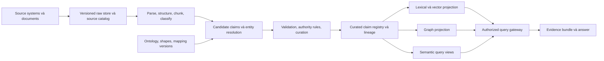

# Knowledge base, knowledge graph và cognitive ontology

**Trạng thái:** thiết kế đề xuất, 06/10/2026. Mục tiêu là một hệ tri thức có thể giải thích, cập nhật, kiểm soát quyền và kiểm thử; graph database là một lựa chọn lưu trữ/phục vụ truy vấn bên trong hệ đó.

## 1. Những khái niệm cần tách

| Khái niệm | Vai trò | Ví dụ |
|---|---|---|
| Taxonomy/vocabulary | Danh mục và nhãn dùng chung | “nhà cung cấp”, “vendor”, “supplier” là nhãn liên quan tới cùng concept |
| Domain ontology | Định nghĩa thực thể, quan hệ, quy tắc ngữ nghĩa của miền | Supplier, Contract, PurchaseOrder; hợp đồng có bên ký và thời hạn |
| Knowledge graph | Các thực thể/khẳng định cụ thể và quan hệ | Supplier S17 là bên ký Contract C42 theo source revision R3 |
| Knowledge base | Toàn bộ tri thức có quản trị | Tài liệu, facts, metric definitions, graph, indexes, lineage, catalog và quy trình curation |
| Operational semantic layer | Định nghĩa chỉ số và action gắn với đối tượng | “Chi tiêu đã cam kết” tính theo định nghĩa có version; thao tác tạo PO có preconditions |
| Cognitive architecture | Tổ chức memory, quyết định và hành động của agent | Khi nào recall, plan, invoke, reflect |
| Cognitive ontology trong thiết kế này | Schema cho trạng thái và bằng chứng của quá trình ra quyết định | Goal, Belief, Evidence, Plan, Action, Observation, Outcome |

Thuật ngữ cuối được dùng như **quy ước kỹ thuật của dự án**. Trong cognitive science, [Cognitive Atlas](https://www.cognitiveatlas.org/) xây ontology về khái niệm và tác vụ nhận thức; phạm vi đó khác với điều phối agent trong doanh nghiệp. [CoALA](https://arxiv.org/abs/2309.02427) cung cấp khung kiến trúc chứ không phải một bộ ontology W3C để cài trực tiếp.

## 2. Bộ chuẩn và cách dùng có giới hạn

| Chuẩn/nguồn | Dùng cho | Không dùng để |
|---|---|---|
| [RDF 1.1](https://www.w3.org/TR/rdf11-concepts/) | Định danh và trao đổi graph bằng IRI/triples/datasets | Thay database transaction hoặc authorization |
| [RDFS/OWL 2](https://www.w3.org/TR/owl2-overview/) | Class/property semantics và inference có định nghĩa hình thức | Chạy workflow hay tự kết luận fact đúng trong thế giới thực |
| [SHACL](https://www.w3.org/TR/shacl/) | Kiểm tra dữ liệu theo shape: datatype, cardinality, quan hệ bắt buộc | Chứng minh nguồn đáng tin hoặc thay policy engine |
| [SKOS](https://www.w3.org/TR/skos-reference/) | Concept scheme, nhãn đa ngôn ngữ, quan hệ và mapping thuật ngữ | Đồng nhất mọi synonym với entity identity |
| [PROV-O](https://www.w3.org/TR/prov-o/) | Biểu diễn nguồn gốc qua entity, activity, agent | Tự thực thi ACL hoặc làm confidence thành xác suất |
| [BFO/IOF](https://www.nist.gov/publications/industrial-ontologies-foundry-iof-core-ontology) | Tham khảo upper/core ontology khi tích hợp miền công nghiệp | Bắt mọi miền nghiệp vụ phải triển khai toàn bộ mô hình nền tảng |
| [DOLCE — ISO/IEC 21838-3:2023](https://committee.iso.org/standard/78927.html?browse=tc) | Một top-level ontology được chuẩn hóa để tham khảo/alignment | Coi tên “cognitive engineering” là chứng nhận nhận thức của LLM |

**Đề xuất:** bắt đầu bằng vocabulary, entity identifiers, claim model, SHACL và provenance. Bổ sung OWL profile khi có câu hỏi cần suy diễn. Chọn RDF 1.1/OWL 2 làm baseline tương thích có chủ đích; không tuyên bố đây là phiên bản mới nhất của mọi họ đặc tả. Profile/serialization mới cần compatibility review trước khi nâng.

OWL áp dụng open-world semantics: chưa biết quan hệ không có nghĩa quan hệ sai. Để kiểm tra “hồ sơ thiếu người phê duyệt” dùng validation/policy với phạm vi dữ liệu đã xác định. OWL domain/range là cơ sở suy diễn kiểu, không phải constraint theo nghĩa SQL. [OWL 2 Primer](https://www.w3.org/TR/owl2-primer/).

## 3. Kiến trúc tri thức: nguồn có thẩm quyền và các projection



Source system vẫn là thẩm quyền cho giao dịch của nó. Claim registry ghi lại thông tin quan sát/nhập vào; không biến graph thành bản thay thế ERP/HRIS. Các index là **projection có thể dựng lại**, có version và freshness watermark.

Với dữ liệu có cấu trúc và chất lượng tốt, ưu tiên mapping/CDC xác định. Không đưa bảng chính thức qua LLM để trích xuất lại các giá trị đã có kiểu. Với PDF/email, LLM có thể tạo candidate claims nhưng chưa tự publish thành sự thật.

### Pipeline tối thiểu

1. **Register:** source owner, connector, tenant, legal/use purpose, sensitivity, ACL, retention và update mechanism.
2. **Acquire:** snapshot/revision, content hash, source IDs, fetched time, deletion/revocation events. Không tải vô hạn theo URL trong tài liệu.
3. **Parse:** giữ page/section/table/cell coordinates; phân biệt text gốc, OCR và text suy đoán. Kiểm tra số tiền, đơn vị, dấu tiếng Việt, ngày và ô bảng.
4. **Normalize:** timezone, currency, entity identifiers, ngôn ngữ; giữ original representation để đối chiếu. Không ghép tên giống nhau thành cùng người/pháp nhân khi thiếu định danh.
5. **Extract:** schema-constrained candidates, evidence span, extractor/model/prompt versions và extraction scores.
6. **Resolve:** deterministic keys trước, matching heuristic sau; các merge rủi ro vào hàng đợi review, giữ merge history và hỗ trợ split.
7. **Validate:** shapes, referential integrity, tenant boundary, temporal constraints, domain rules và evidence existence.
8. **Curate/publish:** source-authority policy quyết định auto-publish hay người duyệt. Tính “được chấp nhận” tách khỏi “confidence cao”.
9. **Project:** cập nhật search/graph theo idempotent events; index version/watermark và reconciliation chống divergence.
10. **Serve/retire:** permission-aware retrieval, freshness checks, correction/deletion propagation, lineage và retention.

## 4. Mô hình ontology nhiều module

| Module | Nội dung tối thiểu | Owner đề xuất |
|---|---|---|
| Foundation | Stable identifiers, time, unit, document, source revision, provenance | Data/platform team |
| Enterprise core | Organization, Person, RoleAssignment, BusinessObject, BusinessEvent, PolicyReference | Data governance + domain stewards |
| Domain | Supplier, Contract, PurchaseOrder, hoặc Ticket, Service, Incident | Domain owner |
| Cognitive/decision | Goal, Belief, Evidence, Plan, ActionProposal, Observation, Outcome | Agent platform + assurance |
| Operational metadata | Tenant, access-policy reference, classification, retention, quality status | Security + data governance |

Module hóa không buộc deploy nhiều triple store. Tránh đưa Role thành subclass cố định của Person: một người có vai trò khác nhau theo tổ chức và thời gian. Dùng `RoleAssignment` có thời hạn/phạm vi. Ontology mô tả quan hệ người-vai trò; IAM/policy service vẫn quyết định quyền thực thi hiện tại.

**Upper ontology:** chỉ align BFO/IOF nếu cần tích hợp tài sản/quy trình công nghiệp, hoặc DOLCE nếu ontology team có lý do ngữ nghĩa rõ. Không nhập cả hai rồi giả định tương thích. Tạo mapping có review, scope và test; `owl:sameAs` rất mạnh, không dùng như fuzzy-match label.

## 5. Competency questions: yêu cầu trước schema

Use case minh họa: nhân viên hỏi “Có thể gia hạn hợp đồng với S17 và tạo bản nháp đơn mua hàng không?”

| ID | Câu hỏi ontology/query phải trả lời | Bằng chứng/đầu ra |
|---|---|---|
| CQ01 | S17 tương ứng pháp nhân nào trong ERP và hợp đồng? | Stable IDs, mapping và nguồn |
| CQ02 | Hợp đồng nào còn hiệu lực tại ngày D? | Valid-time interval và revision |
| CQ03 | Tại ngày K, hệ thống đã biết gì về hiệu lực hợp đồng tại ngày D? | Transaction/system time kết hợp valid time |
| CQ04 | Hai nguồn có mâu thuẫn về điều khoản gia hạn không? | Hai claims, evidence spans, authority ranks |
| CQ05 | Người dùng hiện tại được xem điều khoản và số tiền nào? | Resource IDs để policy gateway đánh giá; không suy quyền bằng LLM |
| CQ06 | Action tạo draft cần dữ liệu nào còn thiếu? | Preconditions theo schema và domain rules |
| CQ07 | Quyết định dựa trên nguồn nào, tool/model/ontology version nào? | Decision provenance |
| CQ08 | Nếu nguồn R3 bị thu hồi, claims, summaries và decisions nào bị ảnh hưởng? | Reverse lineage và invalidation list |
| CQ09 | Đã tạo draft cho logical operation này chưa? | Action ledger và receipt từ ERP |
| CQ10 | Giá trị là trích xuất, suy luận, giả thuyết hay authoritative record? | Claim status, method và source class |

Phương pháp dùng competency questions được nghiên cứu trong [ROCQS/CQ taxonomy](https://arxiv.org/abs/2412.13688); tập CQ trên là đề xuất riêng cho e-agent. Chuyển CQ thành query fixture có positive, negative, missing-data, temporal và ACL cases.

## 6. Claim là đơn vị quản trị, không chỉ node/edge

Một cạnh `S17 hasStatus Approved` không đủ. Cần biết ai nói, nói khi nào, nguồn nào và còn hiệu lực hay không. Ví dụ JSON minh họa với dữ liệu hư cấu:

```json
{
  "claim_id": "urn:tenant:acme:claim:42",
  "tenant_id": "acme",
  "subject": "urn:tenant:acme:supplier:S17",
  "predicate": "https://example.com/ontology/procurement/hasStatus",
  "object": "https://example.com/vocabulary/supplier-status/Approved",
  "status": "accepted",
  "method": "structured-source-mapping",
  "source_system": "erp",
  "source_revision": "supplier-S17-r8",
  "evidence_locator": "supplier/S17/status",
  "valid_from": "2026-10-01T00:00:00+07:00",
  "valid_to": null,
  "recorded_from": "2026-10-02T09:00:00+07:00",
  "recorded_to": null,
  "authority_class": "supplier-master",
  "access_policy_ref": "supplier-master-policy-v3",
  "ontology_version": "procurement-0.1.0",
  "mapping_version": "erp-supplier-v2",
  "supersedes": null
}
```

**Hai trục thời gian:** `valid_*` mô tả thời gian đúng theo nghiệp vụ; `recorded_*` mô tả khoảng thời gian hệ thống lưu phiên bản claim này là hiện hành. Dùng interval nửa mở `[from, to)` và quy tắc timezone thống nhất. Correction hồi tố tạo version mới, đóng recorded interval cũ; không ghi đè mất lịch sử. Truy vấn “as-of knowledge time” không được hồi sinh quyền xem đã thu hồi.

**Mâu thuẫn:** hai claim cùng subject/predicate trong khoảng hiệu lực giao nhau có thể cùng tồn tại. Xác định theo source authority, revision/validity và domain adjudication; không lấy confidence cao nhất để tự giải quyết mọi xung đột. Trạng thái đề xuất: `candidate`, `accepted`, `disputed`, `superseded`, `retracted`.

**Derived facts:** lưu rule version và tập premise IDs. Khi premise mất hiệu lực, thu hồi/recompute tất cả kết quả phụ thuộc. Không mặc định inference giữ nguyên classification của node đích; dữ liệu suy diễn có thể nhạy cảm hơn đầu vào riêng lẻ.

[Graphiti](https://github.com/getzep/graphiti) là một ứng viên tham khảo về temporal graph và custom entity types. Cần kiểm tra riêng khả năng đáp ứng đầy đủ claim contract, quyền, hard delete, indexing và temporal queries; không mặc định library đã triển khai tất cả yêu cầu trên.

## 7. Ontology và validation: ví dụ nhỏ

Ví dụ Turtle sau chỉ thể hiện tách **business entity**, **claim** và **source**. Namespace `example.com` là placeholder; chưa phải ontology đủ dùng production.

```turtle
@prefix ex: <https://example.com/ontology/> .
@prefix owl: <http://www.w3.org/2002/07/owl#> .
@prefix rdfs: <http://www.w3.org/2000/01/rdf-schema#> .
@prefix prov: <http://www.w3.org/ns/prov#> .

ex:Supplier a owl:Class .
ex:SourceRevision a owl:Class ; rdfs:subClassOf prov:Entity .
ex:Claim a owl:Class ; rdfs:subClassOf prov:Entity .
ex:aboutEntity a owl:ObjectProperty .
ex:tenantId a owl:DatatypeProperty .
ex:validFrom a owl:DatatypeProperty .

ex:supplierS17 a ex:Supplier .
ex:sourceR8 a ex:SourceRevision .
ex:claim42 a ex:Claim ;
    ex:aboutEntity ex:supplierS17 ;
    ex:tenantId "acme" ;
    prov:wasDerivedFrom ex:sourceR8 .
```

SHACL kiểm tra contract của claim, độc lập với suy diễn OWL:

```turtle
@prefix ex: <https://example.com/ontology/> .
@prefix sh: <http://www.w3.org/ns/shacl#> .
@prefix xsd: <http://www.w3.org/2001/XMLSchema#> .
@prefix prov: <http://www.w3.org/ns/prov#> .

ex:ClaimShape a sh:NodeShape ;
    sh:targetClass ex:Claim ;
    sh:property [
        sh:path ex:tenantId ;
        sh:minCount 1 ; sh:maxCount 1 ; sh:datatype xsd:string
    ] ;
    sh:property [
        sh:path ex:aboutEntity ;
        sh:minCount 1 ; sh:maxCount 1 ; sh:nodeKind sh:IRI
    ] ;
    sh:property [
        sh:path prov:wasDerivedFrom ;
        sh:minCount 1 ; sh:class ex:SourceRevision
    ] .
```

Shape minh họa chưa kiểm tra đầy đủ claim predicate/object, temporal intervals, tenant equality của evidence, nguồn tồn tại, ACL và trạng thái publish. Bản triển khai phải thêm shape/domain validators và fixtures tương ứng. SHACL pass chỉ cho biết dữ liệu phù hợp constraints đã khai báo. [SHACL](https://www.w3.org/TR/shacl/), [PROV-O](https://www.w3.org/TR/prov-o/).

## 8. Cognitive ontology nên áp dụng thế nào?

Mục tiêu cụ thể: trả lời **agent đang cố làm gì, đang dựa vào thông tin nào, đã đề xuất/thực hiện gì và còn thiếu bằng chứng gì**. Không cố lưu hay suy đoán toàn bộ suy nghĩ nội bộ của model.

### Schema tối thiểu đề xuất

| Class | Thuộc tính/quan hệ tối thiểu | Quy tắc |
|---|---|---|
| `Goal` | Owner, scope, acceptance criteria, deadline | Do user/business event hợp lệ tạo; plugin không tự mở rộng mục tiêu |
| `Belief` | Proposition/claim refs, evidence, epistemic status, expiresAt | Là quan điểm có thể sai; không ghi trực tiếp vào curated KG |
| `Evidence` | Source revision, locator, access scope, observed time | Phải kiểm tra nguồn và quyền khi sử dụng |
| `Plan` / `PlanStep` | Goal, dependencies, preconditions, status, budget | Plan do model đề xuất được validator kiểm tra trước execution |
| `ActionProposal` | Capability, arguments digest, effects, policy refs | Phân biệt với action đã gửi và đã commit |
| `Observation` | Tool receipt/source event, timestamp, trust class | Tool output là dữ liệu; không tự nâng thành instruction |
| `DecisionRecord` | Selected action, evidence refs, policy decision, concise rationale | Rationale phục vụ giải thích, không coi là bản đọc chính xác “suy nghĩ” model |
| `Outcome` | Observed final state, verifier, success/failure/unknown | Ground truth ưu tiên hệ thống đích và domain checker |
| `MemoryCandidate` | Lesson, source episode, applicability, expiry, validation | Không trở thành global procedure chỉ vì một lần thành công |

`Goal → Plan → ActionProposal → ExecutionReceipt → Outcome` được link với evidence và claims. Có thể lưu bằng bảng/JSON có schema trước; chỉ tạo graph projection cho truy vấn lineage/cross-run khi cần.

### Phân chia memory

| Loại | Nội dung | Cơ chế quản trị đề xuất |
|---|---|---|
| Working | Context hiện tại, plan, evidence đang dùng | TTL ngắn, theo run, context budget |
| Episodic | Sự kiện/hành động/kết quả một run | Theo tenant/user/task, redact và retention |
| Semantic | Claims đã chấp nhận, định nghĩa và liên hệ nghiệp vụ | Owner, lineage, ACL, correction, version |
| Procedural | Skill/workflow/tool usage đã được chấp thuận | Artifact registry, code review, signed release, eval |

Phân chia memory lấy cảm hứng từ [CoALA](https://arxiv.org/abs/2309.02427); cơ chế governance trong bảng là đề xuất triển khai của dự án. Không gộp chat log, business fact và instruction đã phê duyệt vào cùng vector namespace.

### Luồng minh họa

1. Nhận goal “tạo draft PO cho S17”, với giới hạn người dùng được phép yêu cầu.
2. Retrieve hợp đồng và supplier status theo ACL; tạo belief “có thể đủ điều kiện” gắn evidence và thời hạn.
3. Policy/rule checker kiểm tra điều kiện; thiếu thông tin thì hỏi hoặc abstain. Belief tự tin không bỏ qua rule.
4. Tạo action proposal, áp dụng approval policy, chạy tool qua action gateway.
5. Lấy receipt từ ERP và verify final state. Chỉ sau đó đánh dấu outcome; timeout giữ trạng thái unknown.
6. Tạo memory candidate nếu có lesson. Domain steward hoặc deterministic policy kiểm chứng trước khi promote; không tự sửa skill/policy production.

**Giới hạn nhận thức:** self-reported confidence không phải xác suất đã hiệu chỉnh. Confidence extraction, source reliability, evidence completeness và policy eligibility là các trường riêng. Không lấy tích các confidence tùy ý rồi gọi là “độ đúng”.

### Lợi ích cần kiểm chứng bằng ablation

So sánh cùng model/corpus/budget: (A) chat history; (B) typed task state + evidence; (C) thêm episodic recall; (D) thêm cognitive graph và controlled memory promotion. Đo resume correctness, số lần tool call thừa, stale-memory errors, explanation coverage, task success và cost. Nếu D không tốt hơn B/C đủ để bù chi phí, giữ schema đơn giản; vẫn có audit tốt mà không cần graph cho mọi memory.

## 9. RDF, property graph hay relational?

| Phương án | Thế mạnh phù hợp | Chi phí/giới hạn cần kiểm chứng |
|---|---|---|
| Relational claim registry + JSON schemas + RDF export | Transaction, access-control integration, vận hành ban đầu đơn giản | Phải tự quản lý semantic mapping; export không đồng nghĩa runtime có OWL semantics |
| RDF store + SHACL + SPARQL | Trao đổi ontology, semantics và validation/inference theo chuẩn | Học query/reasoning, kiểm tra IAM/HA/tooling cụ thể |
| Property graph | Traversal nghiệp vụ, path queries, graph analytics | Mapping ontology và provenance; constraint của engine không mặc nhiên tương đương SHACL/OWL |
| Kết hợp canonical registry + projections | Chọn query engine theo workload, có đường migration | Eventual consistency, rebuild cost, watermark và vận hành nhiều hệ |

**Đề xuất ban đầu:** canonical IDs/claims và ontology artifacts trước, physical engine sau. Có thể khởi đầu bằng relational registry và một search projection. Nếu competency queries cần suy diễn và semantic exchange, thử RDF store; nếu chủ yếu traversal/analytics, thử property graph. Dùng cùng fixtures để chứng minh mapping không mất nghĩa. Tránh dual-write trực tiếp vào hai DB; dùng outbox và projector idempotent.

## 10. Retrieval và quyền xuyên suốt

- Router chọn: direct authoritative lookup cho trạng thái hiện tại; hybrid cho văn bản; graph expansion cho quan hệ; semantic metric API cho số liệu; global summarization cho câu hỏi toàn corpus.
- Filter ACL **trước khi nội dung tới reranker/model**. Query từ model không được tự cung cấp tenant predicate; gateway gắn context đáng tin.
- Graph traversal phải kiểm tra quyền ở cả node, edge, evidence và path trung gian. Một đường đi có thể tiết lộ liên hệ dù output cuối không in tài liệu cấm.
- Summary hoặc inferred claim dựa trên nhiều nguồn mặc định chỉ cho principal được phép xem toàn bộ nguồn phụ thuộc, trừ khi có quy trình declassification riêng. Khi cần mở rộng audience, tạo lại trên tập nguồn được phép.
- Partition/caching theo tenant, principal/scope, policy revision và corpus revision; ACL thay đổi phải invalidate. Không dùng global semantic cache cho dữ liệu nội bộ khác quyền.
- Counts, “không tìm thấy”, timing và tên entity cũng có thể lộ thông tin; trả lỗi thống nhất và kiểm thử inference leakage cho dữ liệu nhạy cảm.
- Chỉ dùng approved query templates/AST validation cho SQL/Cypher/SPARQL; read-only credential, limit, timeout và query cost budget. Không thực thi raw query LLM tạo bằng tài khoản admin.
- Citation cần trỏ tới source revision và location, nhưng citation tồn tại không chứng minh claim được nguồn hỗ trợ. Đánh giá entailment/grounding riêng.

Kết hợp lexical/dense/contextual retrieval là baseline hợp lý để thử; kết quả của [Anthropic Contextual Retrieval](https://www.anthropic.com/engineering/contextual-retrieval) và [GraphRAG](https://arxiv.org/abs/2404.16130) chỉ tạo giả thuyết cho router/eval, không áp đặt cấu hình top-k tối ưu cho corpus này.

## 11. Correction, xóa dữ liệu và ontology evolution

**Correction:** tạo revision mới, đánh dấu claim cũ, propagate invalidation tới graph/vector/summary/cache/memory; giữ lý do và provenance trong phạm vi retention được phép.

**Deletion:** source delete → tombstone chặn serve ngay → reverse-lineage job → xóa hoặc dựng lại derived artifacts → kiểm chứng không recall lại. Các bản sao trong prompts/traces/checkpoints/exports cũng nằm trong inventory. Legal hold và backup retention cần policy riêng; append-only audit không phải lý do giữ PII vĩnh viễn. Tách event metadata tối thiểu khỏi payload có thể xóa, hạn chế đưa PII vào IDs/hash dictionaries.

**Ontology change:** proposal có owner, định nghĩa, examples và CQ → lint/shapes/reasoner trong profile chọn → compatibility review → migration dry-run → shadow projection → CQ regression → publish → deprecate version cũ. Một field vẫn cùng tên nhưng đổi ý nghĩa vẫn là breaking change.

**Governance:** domain steward chịu trách nhiệm nghĩa và source authority; platform team chịu reliability; security/privacy chịu access và lifecycle; ontology maintainer chịu namespace/version/mapping. LLM chỉ đề xuất term/mapping, không tự phê chuẩn.

## 12. Điều kiện để gọi knowledge layer “chuẩn chỉnh”

Mỗi loại câu hỏi quan trọng có CQ/test; mỗi claim được serve có nguồn hoặc derivation rõ; quyền đi theo dữ liệu và artifact suy diễn; sửa/xóa truyền tới mọi projection; truy vấn theo thời gian có semantics; ontology và extractor có version; có người chịu trách nhiệm curation và vận hành. Số node/edge lớn không thay thế được những điều kiện này.
