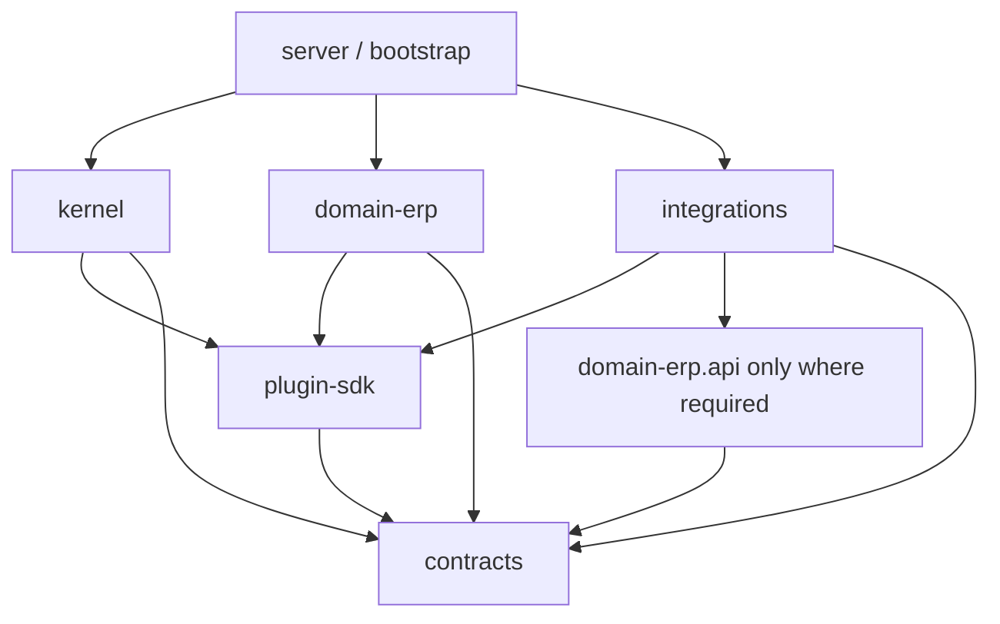

# Tổ chức kiến trúc sản phẩm: packages, plugins và adapters

**Ngày đối chiếu:** 06/10/2026. **Phạm vi:** repo sản phẩm `/Users/thanhnguyen/dev/projects/personal/e-agent`; `enterprise-agent/experiment` tiếp tục phục vụ thực nghiệm. **Trạng thái:** đề xuất để triển khai MVP, chưa tạo runtime hoặc packages thật.

**Bổ sung sau review:** [tài liệu 10](10-extensibility-architecture-review.md) điều chỉnh thiết kế cho multi-domain, knowledge pipeline và independent plugin releases. Cấu trúc sáu package bên dưới là baseline demo gộp integrations; khi cần phát hành adapter độc lập, ưu tiên cấu trúc distributions tách riêng ở tài liệu 10. Số package không phải ràng buộc kiến trúc.

Đọc cùng [các quyết định và bài thử kiến trúc](08-architecture-decisions-and-fitness.md) và [nguồn nghiên cứu bổ sung](09-architecture-source-register.md). Tài liệu này cụ thể hóa [kiến trúc plugin](02-plugin-driven-architecture.md), đồng thời thu hẹp cấu trúc ban đầu để tránh xây một platform quá lớn trước khi có workflow ERP chạy được.

## 1. Khuyến nghị

**Monorepo, modular monolith, ports/adapters và plugin SDK nhỏ; tách process theo mức tin cậy hoặc nhu cầu vận hành.** MVP có một ứng dụng backend, một worker khi cần, một DB chính và một ERP sandbox. Package không mặc nhiên là microservice.

Ba điều phải giữ ổn định: ngữ nghĩa nghiệp vụ, quyền thực thi và bằng chứng kết quả. Model, framework agent, storage và retrieval là các lựa chọn triển khai có thể thay, với conformance tests và migration tương ứng.

Lấy cảm hứng từ [Ports & Adapters của Cockburn](https://alistair.cockburn.us/hexagonal-architecture): application có thể được điều khiển qua UI, CLI hoặc test mà không đưa logic vào giao diện; bên ngoài kết nối qua port. Cấu trúc cụ thể bên dưới là đề xuất của dự án, không phải một cấu trúc “chuẩn duy nhất” được các nguồn bảo đảm.

## 2. Bài học từ các hệ thống đã tổ chức extension tốt

| Nguồn chính thức | Điều đáng học | Áp dụng có chọn lọc |
|---|---|---|
| [OpenTelemetry client design](https://opentelemetry.io/docs/specs/otel/library-guidelines/) | API, SDK và exporter/plugin có vai trò riêng | Plugin phụ thuộc vào hợp đồng nhỏ, không import toàn bộ host/kernel |
| [Backstage extension points](https://backstage.io/docs/backend-system/architecture/extension-points/) | Extension API tách khỏi implementation; ưu tiên điểm mở rộng hẹp | Định nghĩa interface theo năng lực; tránh một `PluginManager` cho phép sửa mọi internals |
| [Backstage backend plugins](https://backstage.io/docs/backend-system/architecture/plugins/) | Chú trọng isolation và state phù hợp horizontal scaling | Plugin không dùng global memory làm nguồn trạng thái nghiệp vụ |
| [PyPA plugin discovery](https://packaging.python.org/en/latest/guides/creating-and-discovering-plugins/) | Entry points công bố plugin qua package metadata | Discover metadata trước; activation phải do host allowlist, không tự load mọi plugin tìm thấy |
| [pluggy](https://pluggy.readthedocs.io/en/stable/) | Hook specifications/implementations cho extension trong process | Có thể dùng cho tooling hoặc observer first-party; không dùng hook chain tùy ý để cấp quyền hành động |
| [HashiCorp go-plugin](https://github.com/hashicorp/go-plugin) | Plugin có thể là subprocess giao tiếp RPC | Ranh giới plugin không cần trùng ngôn ngữ hoặc Python environment; không cần đưa thư viện Go vào MVP |
| [VS Code extension host](https://code.visualstudio.com/api/advanced-topics/extension-host) | Extension có thể chạy ở local, web hoặc remote host tùy khả năng | Manifest khai execution requirements; host chọn nơi chạy phù hợp |
| [uv workspaces](https://docs.astral.sh/uv/concepts/projects/workspaces/) | Multi-package development với lockfile chung | Hợp cho first-party packages; không giải quyết dependency isolation hay xung đột mọi third-party plugin |

Các nguồn này cung cấp pattern và cơ chế, không chứng minh kiến trúc được đề xuất sẽ tự đạt enterprise security. Subprocess tách crash/dependencies nhưng không tự tạo sandbox bảo mật.

## 3. Phân biệt sáu khái niệm

| Khái niệm | Nghĩa trong e-agent | Ví dụ |
|---|---|---|
| Module | Nhóm code có trách nhiệm trong một package | `kernel.approvals` |
| Package/distribution | Đơn vị dependency, build, version và kiểm thử | Distribution `e-agent-plugin-sdk`, import `e_agent_plugin_sdk` |
| Port | Hợp đồng mà thành phần tiêu thụ yêu cầu | `AgentDriver`, `ActionExecutor`, `RunStore` |
| Adapter | Implementation của một port bằng công nghệ cụ thể | Odoo adapter, PostgreSQL RunStore |
| Plugin | Extension có identity, manifest, registration và lifecycle do host quản lý | ERP domain pack hoặc Odoo connector |
| Deployment unit | Process/container/service được triển khai | API process, worker, remote connector |

Một adapter có thể đóng gói thành plugin nếu cần chọn/cấp quyền/version độc lập. Không phải mọi helper hoặc repository class đều cần manifest. Một package có thể chứa vài plugin first-party trong MVP; khi release/dependencies/trust khác nhau mới tách distribution.

## 4. Sáu package thực thi cho MVP

Root chỉ quản lý workspace/tooling, không phải package nghiệp vụ thứ bảy. “Sáu package” là đề xuất phù hợp phạm vi hiện tại, không phải mục tiêu cần giữ mãi.

| Distribution / import root | Sở hữu | Dependency cho phép | Không được chứa |
|---|---|---|---|
| `e-agent-contracts` / `e_agent_contracts` | Wire DTOs chung: IDs, action envelope, receipts, evidence/event schemas | Stdlib + Pydantic được pin theo policy | SDK model provider, ORM, FastAPI, RDF engine, ERP-specific fields |
| `e-agent-plugin-sdk` / `e_agent_plugin_sdk` | Public ports, manifest DTO, lifecycle và registration descriptors | Contracts | Kernel internals, app configuration, DB sessions |
| `e-agent-kernel` / `e_agent_kernel` | Run state machine, action admission, approval checks, budgets, outcome coordination | Contracts + plugin SDK | Odoo, Pydantic AI, graph DB, FastAPI hoặc provider SDK imports |
| `e-agent-domain-erp` / `e_agent_domain_erp` | ERP contracts/ports, capabilities, rules, ontology assets, outcome specifications | Contracts + plugin SDK | Odoo ORM/API types, framework agent internals, database engine |
| `e-agent-integrations` / `e_agent_integrations` | Adapter modules theo công nghệ, có optional dependency groups | Contracts + SDK; Odoo module có thể import public ERP contracts/ports | Kernel internals; import chéo giữa các adapter implementation |
| `e-agent-server` / `e_agent_server` | Composition root, API/CLI entry points, dependency wiring, process lifecycle | Các package trên theo deployment profile | Business rules trong HTTP handlers |

`integrations` là điểm gộp thực dụng cho first-party MVP. `agent_pydantic`, `erp_odoo`, `store_postgres`, `validation_shacl` vẫn là module độc lập với lazy imports và import rules. Khi dependency conflict/release cadence/trust yêu cầu, tách thành `e-agent-adapter-*` mà giữ nguyên plugin IDs và ports.

Tách `contracts` khỏi SDK vì persisted/wire records cần tương thích dài hơn helper/lifecycle code. Dùng Pydantic là lựa chọn có chủ đích: Python API vẫn gắn Pydantic major; wire schema JSON phải được version độc lập để future non-Python plugin không phải dùng Pydantic.

## 5. Cây thư mục đề xuất

```text
e-agent/
├── pyproject.toml                    # workspace/tooling only
├── uv.lock                           # first-party dependency resolution
├── apps/
│   ├── server/
│   │   ├── pyproject.toml
│   │   ├── src/e_agent_server/
│   │   │   ├── bootstrap.py           # the composition root
│   │   │   ├── settings.py
│   │   │   ├── api/                   # auth/context + DTO mapping
│   │   │   ├── cli/
│   │   │   └── worker.py              # separate process entry if needed
│   │   └── tests/
│   └── web/                          # Phase 2; not a uv member
├── packages/
│   ├── contracts/
│   │   ├── pyproject.toml
│   │   └── src/e_agent_contracts/
│   │       ├── execution.py
│   │       ├── evidence.py
│   │       └── events.py
│   ├── plugin-sdk/
│   │   ├── pyproject.toml
│   │   └── src/e_agent_plugin_sdk/
│   │       ├── ports/
│   │       ├── manifest.py
│   │       └── registration.py
│   ├── kernel/
│   │   ├── pyproject.toml
│   │   └── src/e_agent_kernel/
│   │       ├── runs/
│   │       ├── actions/
│   │       ├── approvals/
│   │       ├── policy/
│   │       └── evidence/
│   ├── domain-erp/
│   │   ├── pyproject.toml
│   │   ├── src/e_agent_domain_erp/
│   │   │   ├── api/                   # domain DTOs and ERP ports
│   │   │   ├── procurement/           # use cases + semantic validation
│   │   │   ├── verification/
│   │   │   ├── plugin.py
│   │   │   └── resources/
│   │   │       ├── manifest.json
│   │   │       ├── ontology/
│   │   │       ├── shapes/
│   │   │       ├── prompts/
│   │   │       └── competency-questions/
│   │   └── tests/
│   └── integrations/
│       ├── pyproject.toml
│       ├── src/e_agent_integrations/
│       │   ├── agent_pydantic/
│       │   ├── erp_odoo/
│       │   ├── store_postgres/
│       │   │   └── migrations/
│       │   └── validation_shacl/
│       └── tests/
├── profiles/
│   ├── demo.toml                     # installed/approved selections
│   └── test.toml
├── schemas/                          # generated wire snapshots, no manual forks
├── tests/
│   ├── architecture/
│   ├── conformance/
│   └── end_to_end/
├── evals/                            # tasks/rubrics; separate access for truth
├── docs/
│   ├── architecture/
│   ├── adr/
│   └── runbooks/
├── deploy/
└── research/                         # current research remains here
```

Mỗi package có tests theo trách nhiệm; conformance/e2e ở root. Không tạo sẵn hàng loạt thư mục rỗng cho A2A, marketplace, vector DB hoặc mỗi model vendor. `apps/web` chỉ tạo khi bắt đầu phase UI. Dùng [src layout](https://packaging.python.org/en/latest/discussions/src-layout-vs-flat-layout/) để giảm khả năng test vô tình import source tree thay artifact được cài.

## 6. Chiều phụ thuộc phải có kiểm tra tự động

Sơ đồ dưới là **import/dependency direction**, không phải runtime request flow:



Quy tắc đề xuất:

1. Contracts không import sibling implementation packages. SDK không import kernel.
2. Kernel không import domain-erp, integrations hoặc app; gọi capability/validator/agent qua ports.
3. Domain không import concrete adapters; Odoo adapter dịch Odoo types sang domain DTOs ở boundary.
4. Các integration module độc lập. Ví dụ đổi framework agent không kéo theo sửa Odoo client.
5. Chỉ `bootstrap` biết concrete implementations để wire dependencies. API handlers gọi application/kernel façade, không gọi Odoo trực tiếp.
6. Public interface nằm ở `api/` hoặc module đã công bố; `_internal` không là dependency hợp lệ của package khác.
7. Cross-domain workflow dùng application orchestration và public contracts; không query bảng riêng của domain khác.

CI dùng [Import Linter](https://import-linter.readthedocs.io/en/stable/) cùng wheel-install tests để enforce. Static import checks không chặn mọi dynamic import, reflection hoặc network call; dynamic loading chỉ được phép ở bootstrap/plugin host và phải có runtime tests.

## 7. Tổ chức workspace và distribution

**Ví dụ cấu hình đề xuất**, chỉ để minh họa tổ chức. Chưa có các package tương ứng để build.

Root `pyproject.toml` có thể là virtual workspace:

```toml
[tool.uv.workspace]
members = ["packages/*", "apps/server"]

[tool.uv.sources]
e-agent-contracts = { workspace = true }
e-agent-plugin-sdk = { workspace = true }
e-agent-kernel = { workspace = true }
e-agent-domain-erp = { workspace = true }
e-agent-integrations = { workspace = true }
```

Đoạn metadata của một plugin distribution:

```toml
[project]
name = "e-agent-domain-erp"
version = "0.1.0"
requires-python = ">=3.12"
dependencies = [
  "e-agent-contracts>=0.1.0,<0.2.0",
  "e-agent-plugin-sdk>=0.1.0,<0.2.0",
]

[project.entry-points."e_agent.plugins.v1"]
erp = "e_agent_domain_erp.plugin:create_plugin"
```

Mỗi package cần build backend/config để đóng gói code và resource assets; snippet này chưa phải file build hoàn chỉnh. Root `tool.uv.sources` tiện cho development, nhưng wheel metadata phải có dependencies thật. Không dựa vào path của repo hoặc working directory khi đọc ontology/prompt: dùng package resources.

[uv workspace](https://docs.astral.sh/uv/concepts/projects/workspaces/) dùng lockfile chung và không bảo đảm package chỉ import dependency đã khai báo. Vì vậy: build wheels, cài vào môi trường sạch chỉ gồm dependency closure cần thiết, rồi chạy smoke/conformance tests. Plugin cần dependency xung đột phải có environment/process riêng hoặc project ngoài workspace, không cố giải bằng dynamic `sys.path`.

Tên distribution trong ví dụ là dự kiến, chưa kiểm tra khả năng đăng ký trên public PyPI. Trước public release cần chọn namespace tránh nhầm hoặc dependency confusion; MVP dùng first-party wheels/private index hoặc artifact bundle đã khóa.

## 8. Plugin discovery, installation và activation là ba bước riêng

**Discovery** liệt kê metadata. **Installation** đưa artifact đã kiểm tra vào môi trường. **Activation** cho phép host sử dụng plugin theo profile và grants. Có thể đã cài nhưng bị disable; có thể được discover nhưng chưa được phép load.

Trình tự đề xuất:

```text
CI builds artifact + packaged manifest + tests
    -> admission verifies artifact, publisher policy and compatibility
    -> deployment installs approved artifact
    -> host reads metadata without calling entry-point load()
    -> checks profile, duplicate IDs and dependency versions
    -> imports approved first-party factory / starts isolated worker
    -> validates registrations and performs health checks
    -> exposes granted capabilities to the run
```

[PyPA entry points](https://packaging.python.org/en/latest/guides/creating-and-discovering-plugins/) là cơ chế metadata/discovery. `.load()` import và thực thi module code; nó phải xảy ra sau admission thích hợp. JSON/TOML manifest dùng để kiểm tra tĩnh trước khi gọi factory. Không download/cài package do LLM đề xuất trong run; không build source distribution không tin cậy bên trong API process.

Hai định nghĩa không tương thích đăng ký cùng capability contract ID là lỗi startup, không “last registration wins”. Một contract có thể có nhiều implementation/connection bindings với IDs riêng; host chọn binding theo tenant, policy và resource context, từ chối lựa chọn mơ hồ. Registration phải trả descriptor có kiểu; constructor không gọi network hoặc tạo side effect. `initialize`/`health`/`shutdown` có timeout và được host điều phối. Xem [review multi-domain](10-extensibility-architecture-review.md).

Host quản lý `discovered → admitted → initialized → active → draining → stopped/revoked`. Uninstall không tự xóa evidence hoặc làm rollback business action; disable chặn invocation mới, xử lý in-flight theo action state rồi reconcile.

## 9. Những extension point nên mở

| Port/extension point | Contract cần biểu đạt | Quyền của plugin |
|---|---|---|
| `AgentDriver` | Bước quyết định có giới hạn; trả action proposals, cần input hoặc câu trả lời có evidence | Không tự cấp approval hoặc tự gọi raw ERP client |
| `CapabilityProvider` | Capability ID, schema, effect class, executor binding | Chỉ đăng ký các năng lực đã review |
| `PlanValidator` | Conforms/violations, rule provenance, unknown/error | Không tự đổi policy hoặc thực hiện action |
| `ActionExecutor` | Invoke, receipt, timeout semantics, reconcile support | Credential/resource scope hạn chế |
| `EvidenceRetriever` | Evidence bundle theo identity context, source versions và freshness | Không tự bỏ ACL hoặc tạo authoritative fact |
| `OutcomeVerifier` | Đối chiếu state sau hành động với acceptance criteria | Read-only; không sửa kết quả để pass |
| `RunStore` / `UnitOfWork` | State version, action reservation, atomic event/outbox commit | Do platform triển khai, không tenant tự thay |
| `PolicyEvaluator` | Permit/deny/approval + obligations + version | Trusted platform binding; agent/plugin không override |
| `EventObserver` | Read-only event projection, timeout và redaction | Không chặn audit bắt buộc hoặc đổi action decision |

Không cần mọi port có nhiều implementation ngay. Chỉ mở seam cho thay đổi đã dự kiến có căn cứ hoặc cho trust boundary cần kiểm soát. Không tạo một `UniversalPlugin.execute(context: dict)` dùng cho tất cả.

Phân biệt event subscriber với policy gate: observer có thể lỗi mà run tiếp tục; mandatory audit không ghi được thì write action phải fail closed. Đừng gộp hai semantics này vào cùng hook `after_action`.

## 10. Dùng agent framework mà không để framework sở hữu sản phẩm

Adapter dùng framework để quản lý tương tác model, messages và tool requests. Mọi tool có side effect được biểu diễn thành **deferred/external action**, chuyển về execution gateway của sản phẩm. Các read tools cũng đi qua gateway cấp quyền; không cho framework một client Odoo toàn quyền.

[Pydantic AI deferred tools](https://pydantic.dev/docs/ai/tools-toolsets/deferred-tools/) là một cơ chế phù hợp để thử boundary này. Cần spike trước khi chốt framework: kết thúc/resume có giữ đúng tool-call correlation không, trả lỗi có cấu trúc thế nào và có route nào thực thi tool ngoài gateway không.

MVP chọn **một** agent driver implementation, không viết đồng thời generic loop riêng và framework loop cạnh tranh. Kernel sở hữu trạng thái nghiệp vụ, approval và action lifecycle; agent driver có thể giữ opaque framework continuation đã version. Internal message history không là canonical business record.

Khi đổi framework: drain run cũ trên adapter version cũ hoặc migrate tại checkpoint đã kiểm thử. Không hứa đổi framework giữa run đang pending tool chỉ bằng đổi tên trong config. Khi thêm Temporal, chọn duy nhất một owner cho retries của từng action; xem [Temporal versioning](https://docs.temporal.io/develop/python/versioning) để lập kế hoạch cho workflow đang chạy.

## 11. Domain pack là đơn vị mở rộng nghiệp vụ

ERP domain pack đóng gói: domain DTOs/ports, capability semantics, ontology/vocabulary, validation assets, workflow/prompt references, source mappings, competency questions và outcome specifications. Odoo connector chỉ dịch sang hệ đích; `purchase_request` không được biến thành bản sao raw Odoo model trong toàn hệ thống.

**Một invariant, một nguồn định nghĩa có thẩm quyền.** Quy tắc giới hạn số tiền có thể nằm trong reviewed policy bundle; SHACL validate trên facts từ plan/current ERP state. Không duy trì thêm bản hardcode khác trong prompt và UI rồi để chúng trôi nghĩa. Nếu cần renderer sang text, sinh từ cùng rule inventory có test. Experiment có procedural/SHACL parity là cơ chế đối chứng; product không cần duy trì hai engine runtime nếu không có nhu cầu riêng.

Ontology files thuộc domain pack; SHACL engine thuộc integration. Ontology version, mapping version, source snapshot và validator implementation version đều có trong evidence. `model confidence` không tự publish ontology hay bỏ qua conflict.

Trong MVP, domain pack là dữ liệu/code được review, deploy qua CI. Phase sau có authoring UI: draft → shape/CQ tests → review → versioned publish. Agent vẫn chỉ đọc version được cấp, không tự ghi vào production ontology registry.

## 12. Quyền sở hữu dữ liệu và transactions

| Dữ liệu | Owner logic | Physical storage ban đầu |
|---|---|---|
| Run/action/approval/evidence index | Kernel application services | PostgreSQL qua store adapter |
| ERP transaction thực | Odoo/hệ thống đích | Odoo DB; sản phẩm lưu references và receipts |
| Domain definitions/ontology/shapes | Domain pack | Versioned packaged resources; registry ở phase sau |
| Source revisions/claims | Knowledge module khi được triển khai | Object store/relational canonical registry |
| Retrieval/graph/UI views | Projection owners | Index/query store có thể dựng lại |

Có thể dùng chung DB instance nhưng module khác không tự viết vào bảng của nhau. Store port cần biểu đạt transaction boundary thật: ví dụ action reservation, state transition và outbox event phải atomic trong local DB. Ba repository interface chung chung với ba `save()` độc lập sẽ làm mất bảo đảm này.

Không dùng distributed transaction giả giữa DB sản phẩm và Odoo. Sau external timeout, ledger có trạng thái unknown và reconciliation; thêm orchestrator không tự khép được commit gap. Backup/migration/retention thuộc trách nhiệm owner của dữ liệu.

## 13. Hợp đồng thay đổi ở nhiều tốc độ

| Loại version | Ví dụ | Khi thay đổi |
|---|---|---|
| Distribution version | `e-agent-domain-erp 0.1.3` | Artifact code/assets đổi |
| Plugin API version | `plugin_api = 1` | Factory/lifecycle/registration contract đổi |
| Capability contract | `erp.purchase-request.create.v1` | Ý nghĩa input/output/effect đổi không tương thích |
| Wire event schema | `action.committed.v1` | Consumer contract đổi |
| Ontology/rule bundle | `procurement-2026-10-r2` | Khái niệm, constraints hoặc rule semantics đổi |
| Persistence schema | Migration revision | Storage schema đổi |
| Runtime continuation | Adapter/version-specific | Framework checkpoint serialization đổi |

[SemVer](https://semver.org/) chỉ hữu ích khi public API được định nghĩa. Version `0.x` không mặc nhiên stable; MVP cần explicit tested ranges và compatibility matrix. Tăng minor không chứng minh semantic change an toàn. Giảm ngưỡng mua hàng là policy change cần impact review dù JSON schema không đổi.

Commands/action input dùng validation chặt, từ chối field lạ khi có rủi ro thực thi. Event envelope có schema version, event ID, run ID, correlation/causation IDs, sequence và payload; consumer xử lý version đã biết hoặc đưa vào quarantine. Đừng giả định thêm field luôn backward compatible nếu consumer đang `extra=forbid`.

Wire schemas có thể dùng [JSON Schema 2020-12](https://json-schema.org/draft/2020-12); nội bộ không bắt buộc mọi event là CloudEvent. Khi trao đổi qua broker/external consumers có thể map sang [CloudEvents](https://cloudevents.io/). Giao thức envelope không bảo đảm ordering hay exactly-once; consumer vẫn cần dedup và watermark.

## 14. Chuẩn bị UI explainable và knowledge graph mà không làm chúng ngay

MVP lưu `EvidenceRef`, `ValidationFinding`, `ActionProposal`, `ApprovalRecord`, `ExecutionReceipt`, `OutcomeReport` với version và IDs. UI phase sau đọc projection của các record đó để giải thích. Không lấy hidden chain-of-thought làm audit record.

Khi thêm knowledge graph, canonical entity/claim IDs và provenance không đổi; tạo graph projection và `EvidenceRetriever` adapter phù hợp. Nếu cần đổi claim semantics thì vẫn phải migrate; không coi “có adapter” là miễn phí thay store.

Không cho frontend cài backend plugin bằng import code tùy ý. Phase đầu UI dùng typed API và declarative display metadata cho capability. Nếu sau này cần UI extension thực, thiết kế thêm trust boundary riêng.

## 15. Khi nào mới tách thêm package/process/service?

| Trigger thực tế | Hành động |
|---|---|
| Hai integration cần dependency versions không thể cùng resolve | Tách distribution/environment, RPC adapter nếu cần |
| Third-party connector không được tin ngang host | Tách worker + giới hạn OS/network/credentials; subprocess đơn thuần chưa đủ |
| Một domain có owner, release cadence hoặc external consumers riêng | Tách domain API/implementation distribution, công bố support policy |
| Ingestion GPU hoặc graph indexing có tải khác execution | Tách worker/process với queue, giữ contracts |
| Tenant/residency hoặc blast radius đòi isolation vật lý | Tách deployment/database theo threat model |
| Chỉ vì thư mục dài hoặc đang có trend microservices | Refactor module trước; chưa đủ lý do thêm network boundary |

**Thước đo kiến trúc tốt:** một thay đổi công nghệ có phạm vi sửa và kiểm thử rõ ràng. Số package, số interface hay số plugin không phải thước đo độc lập của chất lượng.
